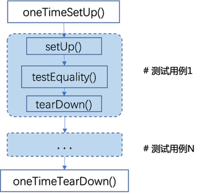

# EulerPublisher

EulerPublisher是Infra SIG提供的”一键式“自动构建和发布openEuler镜像的工具，承载容器镜像和云镜像构建、发布的能力。

EulerPublisher处于开发过程中，目前已向PyPI上传软件包，请使用以下两种方式之一进行安装
1. 下载源码到本地，执行
```
python setup.py install
```
2. 使用`pip`安装，执行
```
pip install eulerpublisher
```

## 环境依赖
1.EulerPublisher实现多平台容器镜像构建功能依赖于docker和qemu，实现镜像分析与瘦身依赖于slim，安装方式如下：

```
yum install qemu-img
yum install docker
curl -sL https://raw.githubusercontent.com/slimtoolkit/slim/master/scripts/install-slim.sh | sudo -E bash -
```
多平台镜像构建使用`docker buildx`，安装的docker版本需满足`>= 19.03`或单独安装`buildx`插件，单独安装`docker buildx`方法如下：

1). 从[Docker buildx](https://github.com/docker/buildx/releases/tag/v0.11.1)项目的`release`页面找到适合自己平台的二进制文件。

2). 下载二进制文件到本地并重命名为`docker-buildx`，移动到`docker`的插件目录`~/.docker/cli-plugins`。

3). 向二进制文件授予可执行权限`chmod +x ~/.docker/cli-plugins/docker-buildx`。

2.EulerPublisher使用python实现，依赖见[requirements.txt](requirements.txt)，安装如下：
```
pip install -r ./requirements.txt
```

3.EulerPublisher基于[shUnit2](https://github.com/kward/shunit2)测试框架实现镜像测试特性，使用测试功能时需要预置 `shUnit2`, 方法如下：
```
# 下载shUnit2源码
curl -fSL -o shunit2.tar.gz https://github.com/kward/shunit2/archive/refs/tags/v2.1.8.tar.gz

# 解压并移动至/usr/re/shunit2目录
mkdir -p /usr/share/shunit2
tar -xvf shunit2.tar.gz -C /usr/share/shunit2 --strip-components=1
```


## 使用说明

### 1. 发布容器镜像

#### 基础容器镜像

本部分介绍如何使用EulerPublisher发布多平台（支持amd64和arm64）openeuler基础容器镜像(区分于应用镜像，如AI容器镜像)。该功能可用于EulerPublisher从[openEuler](https://repo.openeuler.org)官方获取容器镜像，进行二次定制后发布至第三方仓库，镜像制品的tag严格遵守[oEEP-0005](https://gitee.com/openeuler/TC/blob/master/oEEP/oEEP-0005%20openEuler官方容器镜像发布流程.md)的规范。
-  **步骤1** 、获取构建基础镜像的必要文件

```
eulerpublisher container base prepare -v {VERSION} -i {INDEX}
```
  这个命令中`-v`必须显式指定，用于获取对应版本的构建所需文件。 `-i`指定官方镜像的路径，可选`docker_img`或`docker_img/update/Y-M-D`, 选择`docker_img`表明获取openeuler的`release`版本、选择`docker_img/update/Y-M-D`表明获取`update`版本，不显式指定时默认获取`release`版本进行二次定制。

-  **步骤2** 、构建并push镜像到目标仓库

执行本步之前，需要先配置push的目标仓库username和password的环境变量用以登陆，确保push可以成功，执行
```
export LOGIN_USERNAME="username"
export LOGIN_PASSWORD="password"
```
完成上述**步骤1**并配置`LOGIN_USERNAME`、`LOGIN_PASSWORD`之后，可执行如下命令进行build和push
```
eulerpublisher container base push -p {REPO} -v {VERSION} -g {REGISTRY} -f {DOCKERFILE}
```
  此命令中，`-p`和`-v`必须显式指定，`-g`不显式指定时默认指向dockerhub ([https://hub.docker.com](https://hub.docker.com))，`-f`指定自定义dockerfile的路径，不显式指定时使用默认[Dockerfile](config/container/base/Dockerfile)。由于`docker buildx build`构建的多平台image无法在本地缓存，build的时候必须同步push到对应repo（可以是私有的）。因此，有测试需求的情况下，尽量先将构建的container image push到私有仓库验证完成后再publish到最终目标仓库。

-  **步骤3** 、测试基础容器镜像

```
eulerpublisher container base check -t {TAG} -s {SCRIPT.sh}
```
上述命令将对标签为{TAG}的基础容器镜像进行测试。EulerPublisher使用[shUnit2](https://github.com/kward/shunit2)框架进行容器镜像测试，基础容器镜像的测试用例默认保存在`tests/container/base/openeuler_test.sh`，用户可根据自身需求使用`-s`调整测试用例。

- **一键发布**

```
# 向单个仓库发布容器镜像：
eulerpublisher container base publish -p {REPO} -v {VERSION} -i {INDEX} -g {REGISTRY} -f {Dockerfile}
```
此命令是上述**步骤**1～2的顺序功能集合，每个参数的含义与上述相同。使用示例如下
```
示例：
eulerpublisher container base publish -p openeuler/openeuler -v 22.03-LTS-SP1 -g registry-1.docker.io -f Dockerfile
```
上述执行的效果是向Docker Hub([https://hub.docker.com](https://hub.docker.com))的`openeuler/openeuler`仓库发布由`Dockerfile`定制的tag为`22.03-LTS-SP1`的支持arm64、amd64多平台的openeuler基础容器镜像。

为了方便将一个镜像同时发布到多个仓库，可使用如下命令：
```
# 向多个仓库发布容器镜像：
eulerpublisher container base publish -v {VERSION} -i {INDEX}  -f {Dockerfile} -m
```
  此命令使用`-m`使能"publish one image to multiple repositories", 不再需要设置`-p`和`-g`参数。目标repositories的信息由yaml文件决定，用户通过配置环境变量`EP_LOGIN_FILE`来指定该文件的路径。默认的目标repositories信息由[config/container/base/registry.yaml](config/container/base/registry.yaml)指定，内容如下
```
# registry.yaml内容示例
registry-1:
  - LOGIN_USER_1
  - LOGIN_PASSWD_1
  - registry-1/{USER_1}/{REPOSITORY-1}

registry-2:
  - LOGIN_USER_2
  - LOGIN_PASSWD_2
  - registry-2/{USER_2}/{REPOSITORY-2}

  ...
```
其中每个仓库都维护一组信息，{LOGIN_USER_1}和{LOGIN_PASSWD_1}分别是登录registry-1的用户名和密码的环境变量（发布之前需要通过`export`配置正确的用户和密码），registry-1/{USER_1}/{REPOSITORY-1}是完整的仓库路径，其他仓库的信息也是如此。

#### 应用容器镜像

openEuler应用容器镜像是在基础容器镜像之上包含特定场景的应用软件，向用户提供开箱即用的开发、使用体验，例如AI容器镜像（见[oEEP-0014](https://gitee.com/openeuler/TC/blob/master/oEEP/oEEP-0014%20openEuler%20AI容器镜像软件栈规范.md)）。
```
# 应用容器镜像发布
eulerpublisher container app publish -a aarch64 -p openeuler/cann -f Dockerfile -t cann7.0.0.aplha002-oe2203sp2
```
```
# 应用容器镜像测试
eulerpublisher container app check -n {APP_NAME} -s {SCRIPT.sh} -t {APP_TAG}
```
应用容器镜像的测试用例默认保存在`tests/container/app/{APP_NAME}_test.sh`，用户可根据自身需求使用`-s`指定测试用例脚本。

#### 测试框架
EulerPublisher使用[shUnit2](https://github.com/kward/shunit2)测试框架。本项目每个应用容器镜像通过一个shell脚本进行测试，默认保存在`tests/container/app/`目录，测试脚本命名为`{APP_NAME}_test.sh`。每个测试脚本的关键内容如下：
```
每个测试脚本中，所有的测试用例以函数粒度构造，且函数名以“test”开头，如，testEquality()
每个测试脚本执行之前，shUnit2会检查一个名为oneTimeSetUp()的函数，如果存在则执行；
每个测试脚本执行结束，shUnit2会检查一个名为oneTimeTearDown()的函数，如果存在则执行；
每个测试用例执行之前，shUnit2会检查一个名为setUp()的函数，如果存在则在本shell内每个testcase之前运行；
每个测试用例执行结束，shUnit2会检查一个名为tearDown()的函数，如果存在则在本shell内每个testcase结束运行；
```


欢迎广大开发者贡献测试用例！

### 2. 构建cloud images
#### 通用云镜像构建
使用EulerPublisher在本地执行机上进行通用云镜像构建，定制的镜像符合大多数主流云厂商镜像发布的要求，可用于发布。
-  **步骤1** 、基础构建准备
```
eulerpublisher cloudimg gen prepare -v {VERSION} -a {ARCH}
```
此命令中所有参数均需显式指定，`-v`是构建目标镜像的openEuler版本号，`-a`指定构建目标镜像的架构类型，目前仅支持`aarch64`或`x86_86`，
该步骤实现的功能是从openEuler Repo获取基础镜像，用于下一步定制。
-  **步骤2** 、构建通用镜像
```
eulerpublisher cloudimg gen build -v {VERSION} -a {ARCH} -o {NAME} -p {RPMLIST}
```
此命令中`{NAME}`指定最终构建镜像的名称，`{RPMLIST}`是用户需要预安装的软件包列表文件，一旦指定不能为空。其余参数作用与步骤1命令中参数作用一致。
```
# rpmlist内容示例
tar
make
zip
curl
...
```
执行此命令后，会在执行机`/tmp/eulerpublisher/cloudimg/gen/output/`目录下生成一个命名为`{NAME}`的最终镜像，该镜像满足目前大多数主流公有云厂商云市场镜像发布的技术要求，用户可手动进行镜像发布。

#### AWS云镜像构建
使用EulerPublisher构建AMI时，需要预先使用`awscli`进行`aws configure`配置，完成身份认证，配置信息如下：
```
$ aws configure
- AWS Access Key ID: <key_id>
- AWS Secret Access Key: <secret_key>
- Default region name: <region>
```
其中，`key_id`和`secret_key`是一对用于访问认证的密钥对，生成方法参见[AWS管理访问密钥](https://docs.aws.amazon.com/zh_cn/IAM/latest/UserGuide/id_credentials_access-keys.html?icmpid=docs_iam_console#Using_CreateAccessKey)，`region`是执行构建AMI任务的域。
-  **步骤1** 、AMI构建准备

```
eulerpublisher cloudimg aws prepare -v {VERSION} -a {ARCH} -b {BUCKET}
```
此命令中所有参数均需显式指定，`-v`是构建目标AMI的openEuler版本号，`-a`指定构建AMI的架构类型，目前仅支持`aarch64`或`x86_86`，
`-b`是存储桶名，存储桶用于保存`prepare`上传的原始`raw`镜像，`bucket`在`aws configure`配置的`region`内。

执行此命令后，会在AWS对应`region`的`bucket`中出现一个命名为`openEuler-{VERSION}-{ARCH}.raw`的原始镜像（例如：openEuler-22.03-LTS-SP2-x86_64.raw）。
-  **步骤2** 、构建AMI

```
eulerpublisher cloudimg aws build -v {VERSION} -a {ARCH} -b {BUCKET} -r {REGION} -p {RPMLIST}
```
此命令中除`-p`以外的所有参数均需显式指定，参数作用与`eulerpublisher cloudimg aws prepare`命令一致。EulerPublisher通过[aws_install.sh](config/cloudimg/script/aws_install.sh)实现定制AMI镜像的能力，目前默认的[aws_install.sh](config/cloudimg/script/aws_install.sh)满足构建得到的AMI符合AWS Marketplace AMI发布的要求，需要预安装到镜像中的软件由`--rpmlist`指定的文件{RPMLIST}确定。
```
# rpmlist示例
tar
make
zip
curl
...
```

执行此命令后，会在AWS对应`region`的`EC2 AMI`列表中生成一个命名为`openEuler-{VERSION}-{ARCH}-{TIME}-hvm`的最终镜像（例如：`openEuler-22.03-LTS-SP2-x86_64-20230802_010324-hvm`）。

-  **发布AMI到AWS Marketplace**

同时，eulerpublisher提供“一键发布”到AWS个人账户的能力，即上述步骤1、2的顺序执行，命令如下：
```
eulerpublisher cloudimg aws publish -v {VERSION} -a {ARCH} -b {BUCKET} -r {REGION} -p {RPMLIST}
```
生成的AMI满足AWS Marketplace云镜像发布的要求，如有需要可进行镜像产品发布。由于AWS Marketplace存在人工审核环节，无法通过自动化流程一键发布，用户需手动操作申请发布AMI，见[https://aws.amazon.com/marketplace](https://aws.amazon.com/marketplace/partners/management-tour)。
### 3. 镜像分析与优化
#### Dockerfile静态分析

本部分介绍如何使用EulerPublisher对Dockerfile执行静态分析。`lint` 命令会分析你的 Dockerfile，对 Dockerfile 中的指令进行检查。此命令会提供警告，并检查错误，同时为你提供 Dockerfile 中指令的相关信息。它会检查缺失的文件、无效的指令或命令，以及 Dockerfile 中不必要的或难以管理的层。同时，`lint` 命令还会检查 .dockerignore 文件，确保在构建镜像时正确排除不必要的文件和目录。

```
eulerpublisher container lint -r {REPORTPATH} -t {DOCKERFILEPATH}
```
   `REPORTPATH`为Dockerfile静态分析生成报告的路径，默认在当前目录生成`lint.report.json`。`DOCKERFILEPATH`为需要分析的Dockerfile文件路径。使用示例如下
```
eulerpublisher container lint -r ./report/lint.report.json -t Dockerfile 
```
#### 镜像静态分析

本部分介绍如何使用EulerPublisher对目标容器镜像执行静态分析（包括对镜像的 Dockerfile 进行“逆向工程”）。`analyze` 命令主要用于静态分析 Docker 镜像。它会深入探索 Docker 镜像的各层、使用的命令、文件、库、可执行文件以及当 Docker 镜像构建时将在工作环境中产生的变更。这个命令能够帮助逆向工程出 Dockerfile，即从目标 Docker 镜像反推出 Dockerfile。同时，`analyze` 也会提供对象文件的大小信息，以及容器空间中可能存在的浪费情况。

```
eulerpublisher container analyze -r {REPORTPATH} -i {IMAGEID}
```
   `REPORTPATH`为镜像静态分析生成报告的路径，默认在当前目录生成`analyze.report.json`。`IMAGEID`为本地镜像的`image id`或`repository:tag`，当`IMAGEID`不存在时会直接从dockerhub拉取，因此有出现镜像不存在而无法分析的错误。使用示例如下
```
eulerpublisher container analyze -i nginx:latest
```

  可以通过终端打印的`artifacts.location`获取逆向Dockerfile路径。默认路径为'/tmp/slim-state/.slim-state/images/{IMAGEID}/artifacts' ，IMAGEID为镜像ID的完整十六进制 SHA-256 哈希值，可通过```docker ps -a --no-trunc```查看。示例路径如下

```
cmd=xray info=results '/tmp/slim-state/.slim-state/images/605c77e624ddb75e6110f997c58876baa13f8754486b461117934b24a9dc3a85/artifacts' 
```
#### 镜像动态分析

本部分介绍如何使用EulerPublisher对目标容器镜像执行动态分析（包括对镜像的 Dockerfile 进行“逆向工程”）。`profile` 命令进行更为深入的动态分析。它不仅分析 Docker 镜像，还会运行该镜像并创建一个容器，然后对这个容器进行分析和探测。这意味着 `profile` 命令会在实际运行环境中收集数据，从而获得比 `analyze` 更多的信息。此外，`profile` 命令还默认提供了高级的 HTTP 探针功能，可以检查 Docker 容器的可达性和响应情况。与`analyze`命令一样，`profile`也会为镜像生成逆向Dockerfile。

```
eulerpublisher container profile -r {REPORTPATH} -i {IMAGEID}
```
   `REPORTPATH`为镜像动态分析生成报告的路径，默认在当前目录生成`profile.report.json`。`IMAGEID`为本地镜像的`image id`或`repository:tag`，当`IMAGEID`不存在时会直接从dockerhub拉取，因此有出现镜像不存在而无法分析的错误。使用示例如下
```
eulerpublisher container profile -r nginx.profile.report.json -i nginx:latest
```
#### 镜像优化

本部分介绍如何使用EulerPublisher分析目标容器镜像及其应用程序，并从中构建优化的镜像。`slim` 命令会分析 Docker 镜像，移除不需要的层、文件和依赖项，从而显著减小镜像的大小，提高加载和部署速度，节省存储空间和网络传输时间，加强镜像安全性。

```
eulerpublisher container slim -r {REPORTPATH} -i {IMAGEID} -t {repository:tag} -p {TRUE/FALSE}
```
   `REPORTPATH`为镜像优化生成报告的路径，默认在当前目录生成`slim.report.json`。`IMAGEID`为本地镜像的`image id`或`repository:tag`，当`IMAGEID`不存在时会直接从dockerhub拉取，因此有出现镜像不存在而无法分析的错误。`repository:tag`为优化后镜像的名称。`-p`指示是否开启http探测，目标镜像并未暴露端口时（如hello-world应用），请关闭此选项。使用示例如下
```
eulerpublisher container slim -r nginx.slim.report.json -i d2c94e258dcb -t nginx.slim:latest -p true
```
