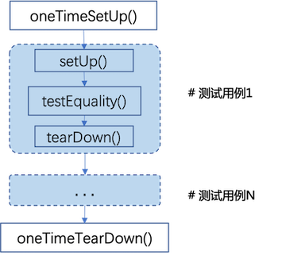

# EulerPublisher

EulerPublisher是Infra SIG提供的”一键式“自动构建和发布openEuler镜像的工具，承载容器镜像和云镜像构建、发布的能力。

EulerPublisher处于开发过程中，目前已向PyPI上传软件包，请使用以下两种方式之一进行安装
1. 下载源码到本地，执行
```
python setup.py install
```
2. 使用`pip`安装，执行
```
pip install eulerpublisher
```

## 环境依赖
1.EulerPublisher实现多平台容器镜像构建功能依赖于docker和qemu，安装方式如下：

```
yum install qemu-img
yum install docker
```
多平台镜像构建使用`docker buildx`，安装的docker版本需满足`>= 19.03`或单独安装`buildx`插件，单独安装`docker buildx`方法如下：

1). 从[Docker buildx](https://github.com/docker/buildx/releases/tag/v0.11.1)项目的`release`页面找到适合自己平台的二进制文件。

2). 下载二进制文件到本地并重命名为`docker-buildx`，移动到`docker`的插件目录`~/.docker/cli-plugins`。

3). 向二进制文件授予可执行权限`chmod +x ~/.docker/cli-plugins/docker-buildx`。

2.EulerPublisher使用python实现，依赖见[requirements.txt](requirements.txt)，安装如下：
```
pip install -r ./requirements.txt
```

3.EulerPublisher基于[shUnit2](https://github.com/kward/shunit2)测试框架实现镜像测试特性，使用测试功能时需要预置 `shUnit2`, 方法如下：
```
# 下载shUnit2源码
curl -fSL -o shunit2.tar.gz https://github.com/kward/shunit2/archive/refs/tags/v2.1.8.tar.gz

# 解压并移动至/usr/share/shunit2目录
mkdir -p /usr/share/shunit2
tar -xvf shunit2.tar.gz -C /usr/share/shunit2 --strip-components=1
```
💡Tips: 推荐使用脚本`install.sh`、`uninstall.sh`进行一键安装、卸载。

## 使用说明

### 1. 发布云镜像
使用EulerPublisher在本地执行机上进行云镜像构建，定制的镜像符合大多数主流云厂商镜像发布的要求，可用于发布。
-  **步骤1** 、基础构建准备
```
eulerpublisher cloudimg prepare -v {VERSION} -a {ARCH}
```
此命令中所有参数均需显式指定，`-v`是构建目标镜像的openEuler版本号，`-a`指定构建目标镜像的架构类型，目前仅支持`aarch64`或`x86_64`，
该步骤实现的功能是从openEuler Repo获取基础镜像，用于下一步定制。
-  **步骤2** 、构建云镜像
```
eulerpublisher cloudimg build -t {TARGET} -v {VERSION} -a {ARCH}
```
此命令中`{TARGET}`指定公有云厂商，其余参数作用与步骤1命令中参数作用一致。
执行此命令后，会在执行机`/tmp/eulerpublisher/cloudimg/gen/output/`目录下生成一个命名为`openEuler-{VERSION}-{ARCH}-{TIME}.qcow2`的目标镜像（例如：`openEuler-22.03-LTS-SP2-x86_64-20230802_010324.qcow2`），该镜像满足目前大多数主流公有云厂商云市场镜像发布的技术要求。
-  **步骤3** 、上传云镜像

执行本步之前，需要预先使用公有云厂商提供的命令行工具进行配置，完成身份认证，配置信息如下：
```
# 华为云 OBS存储命令行工具
$ obsutil config -interactive
- Please input your ak:
- <key_id>
- Please input your sk:
- <secret_key>
- Please input your endpoint:
- <endpoint>

# 阿里云 OSS存储命令行工具
$ ossutil config
- Please input your endpoint:
- <endpoint>
- Please input your accessKeySecret:
- <secret_key>
- Please input your accessKeyID:
- <key_id>

# 腾讯云 COS存储命令行工具
$ coscli config init
- Input Your Secret ID:
- <key_id><endpoint>
- Input Your Secret Key: 
- <secret_key>
- Input Bucket's Endpoint:
- <endpoint>

# AWS S3存储命令行工具
$ aws configure
- AWS Access Key ID: <key_id>
- AWS Secret Access Key: <secret_key>
- Default region name: <region>
```
其中，`key_id`和`secret_key`是一对用于访问认证的密钥对，`endpoint`是存储桶的接入点。有关访问密钥的详细信息，请参考[华为云管理访问密钥](https://support.huaweicloud.com/usermanual-ca/ca_01_0003.html)，[阿里云管理访问密钥](https://help.aliyun.com/zh/ram/user-guide/create-an-accesskey-pair)，[腾讯云管理访问密钥](https://cloud.tencent.com/document/product/598/40488)，[AWS管理访问密钥](https://docs.aws.amazon.com/zh_cn/IAM/latest/UserGuide/id_credentials_access-keys.html?icmpid=docs_iam_console#Using_CreateAccessKey)。
```
export HUAWEICLOUD_SDK_AK="key_id"
export HUAWEICLOUD_SDK_SK="secret_key"
export ALIBABACLOUD_SDK_AK="key_id"
export ALIBABACLOUD_SDK_SK="secret_key"
export TENCENTCLOUD_SDK_AK="key_id"
export TENCENTCLOUD_SDK_SK="secret_key"
export AWS_SDK_AK="key_id"
export AWS_SDK_SK="secret_key"
```
完成上述步骤后，可执行如下命令上传云镜像
```
eulerpublisher cloudimg push -t {TARGET} -v {VERSION} -a {ARCH} -r {REGION} -b {BUCKET} -f {FILE}
```
此命令中`{REGION}`指定地域，`{BUCKET}`指定存储桶，`{FILE}`指定云镜像文件，其余参数作用与步骤2命令中参数作用一致。
执行此命令后，会将云镜像文件上传至公有云厂商对应地域的存储桶，同时还会在对应地域的镜像列表生成一个命名为`openEuler-{VERSION}-{ARCH}`的最终镜像。

### 2. 发布容器镜像

#### 基础容器镜像

本部分介绍如何使用EulerPublisher发布多平台（支持amd64和arm64）openeuler基础容器镜像(区分于应用镜像，如AI容器镜像)。该功能可用于EulerPublisher从[openEuler](https://repo.openeuler.org)官方获取容器镜像，进行二次定制后发布至第三方仓库，镜像制品的tag严格遵守[oEEP-0005](https://gitee.com/openeuler/TC/blob/master/oEEP/oEEP-0005%20openEuler官方容器镜像发布流程.md)的规范。
-  **步骤1** 、获取构建基础镜像的必要文件

```
eulerpublisher container base prepare -v {VERSION} -i {INDEX}
```
  这个命令中`-v`必须显式指定，用于获取对应版本的构建所需文件。 `-i`指定官方镜像的路径，可选`docker_img`或`docker_img/update/Y-M-D`, 选择`docker_img`表明获取openeuler的`release`版本、选择`docker_img/update/Y-M-D`表明获取`update`版本，不显式指定时默认获取`release`版本进行二次定制。

-  **步骤2** 、构建并push镜像到目标仓库

执行本步之前，需要先配置push的目标仓库username和password的环境变量用以登陆，确保push可以成功，执行
```
export LOGIN_USERNAME="username"
export LOGIN_PASSWORD="password"
```
完成上述**步骤1**并配置`LOGIN_USERNAME`、`LOGIN_PASSWORD`之后，可执行如下命令进行build和push
```
eulerpublisher container base push -p {REPO} -v {VERSION} -g {REGISTRY} -f {DOCKERFILE}
```
  此命令中，`-p`和`-v`必须显式指定，`-g`不显式指定时默认指向dockerhub ([https://hub.docker.com](https://hub.docker.com))，`-f`指定自定义dockerfile的路径，不显式指定时使用默认[Dockerfile](config/container/base/Dockerfile)。由于`docker buildx build`构建的多平台image无法在本地缓存，build的时候必须同步push到对应repo（可以是私有的）。因此，有测试需求的情况下，尽量先将构建的container image push到私有仓库验证完成后再publish到最终目标仓库。

-  **步骤3** 、测试基础容器镜像

```
eulerpublisher container base check -t {TAG} -s {SCRIPT.sh}
```
上述命令将对标签为{TAG}的基础容器镜像进行测试。EulerPublisher使用[shUnit2](https://github.com/kward/shunit2)框架进行容器镜像测试，基础容器镜像的测试用例默认保存在`tests/container/base/openeuler_test.sh`，用户可根据自身需求使用`-s`调整测试用例。

- **一键发布**

```
# 向单个仓库发布容器镜像：
eulerpublisher container base publish -p {REPO} -v {VERSION} -i {INDEX} -g {REGISTRY} -f {Dockerfile}
```
此命令是上述**步骤**1～2的顺序功能集合，每个参数的含义与上述相同。使用示例如下
```
示例：
eulerpublisher container base publish -p openeuler/openeuler -v 24.03-LTS-SP2 -g registry-1.docker.io -f Dockerfile
```
上述执行的效果是向Docker Hub([https://hub.docker.com](https://hub.docker.com))的`openeuler/openeuler`仓库发布由`Dockerfile`定制的tag为`24.03-LTS-SP2`的支持arm64、amd64多平台的openeuler基础容器镜像。

为了方便将一个镜像同时发布到多个仓库，可使用如下命令：
```
# 向多个仓库发布容器镜像：
eulerpublisher container base publish -v {VERSION} -i {INDEX}  -f {Dockerfile} -m
```
  此命令使用`-m`使能"publish one image to multiple repositories", 不再需要设置`-p`和`-g`参数。目标repositories的信息由yaml文件决定，用户通过配置环境变量`EP_LOGIN_FILE`来指定该文件的路径。默认的目标repositories信息由[config/container/base/registry.yaml](config/container/base/registry.yaml)指定，内容如下
```
# registry.yaml内容示例
registry-1:
  - LOGIN_USER_1
  - LOGIN_PASSWD_1
  - registry-1/{USER_1}/{REPOSITORY-1}

registry-2:
  - LOGIN_USER_2
  - LOGIN_PASSWD_2
  - registry-2/{USER_2}/{REPOSITORY-2}

  ...
```
其中每个仓库都维护一组信息，{LOGIN_USER_1}和{LOGIN_PASSWD_1}分别是登录registry-1的用户名和密码的环境变量（发布之前需要通过`export`配置正确的用户和密码），registry-1/{USER_1}/{REPOSITORY-1}是完整的仓库路径，其他仓库的信息也是如此。

#### 应用容器镜像

openEuler应用容器镜像是在基础容器镜像之上包含特定场景的应用软件，向用户提供开箱即用的开发、使用体验，例如AI容器镜像（见[oEEP-0014](https://gitee.com/openeuler/TC/blob/master/oEEP/oEEP-0014%20openEuler%20AI容器镜像软件栈规范.md)）。
```
# 应用容器镜像发布
eulerpublisher container app publish -a aarch64 -p openeuler/cann -f Dockerfile -t cann7.0.0.aplha002-oe2203sp2
```
```
# 应用容器镜像测试
eulerpublisher container app check -n {APP_NAME} -s {SCRIPT.sh} -t {APP_TAG}
```
应用容器镜像的测试用例默认保存在`tests/container/app/{APP_NAME}_test.sh`，用户可根据自身需求使用`-s`指定测试用例脚本。

#### Distroless镜像
openEuler distroless镜像是安装指定的应用软件列表，满足在特定场景下程序运行的软件集合。不安装无用软件和文件，如包管理器yum、命令行工具bash等一些程序运行无关的工具。

EulerPublisher通过与[splitter](https://gitee.com/openeuler/splitter)集成，使用openEuler软件包切分后的slice作为构建应用镜像的基础材料来生成openEuler distroless镜像。

```
# distroless镜像发布
eulerpublisher container distroless publish -p openeuler/distroless-hello -t latest -f Distrofile
```
其中`-a`,`-t`和`-p`作用与上文中表述一致，`-f`用于指定构建openEuler distroless镜像的配置文件，作用类似于Dockerfile。其中`Distrofile格式如下：
```
# Distrofile
name: distroless-hello                        # 镜像名称
summary: summary for `hello` image            # 镜像描述
base: scratch                                 # 基础镜像
release: 24.03-LTS                            # openEuler版本
platforms:                                    # 镜像架构
  - linux/amd64                               # 与docker buildx --platform的可选参数保持一致
  - linux/arm64

parts:                                        # 构建镜像所需的slice
  - slice1
  - slice2
  ...
```

**注意**：`Distrofile`在构建distroless镜像时为必须提供。

#### 容器镜像测试
EulerPublisher使用[shUnit2](https://github.com/kward/shunit2)测试框架。本项目每个应用容器镜像通过一个shell脚本进行测试，默认保存在`tests/container/app/`目录，测试脚本命名为`{APP_NAME}_test.sh`。每个测试脚本的关键内容如下：
```
每个测试脚本中，所有的测试用例以函数粒度构造，且函数名以“test”开头，如，testEquality()
每个测试脚本执行之前，shUnit2会检查一个名为oneTimeSetUp()的函数，如果存在则执行；
每个测试脚本执行结束，shUnit2会检查一个名为oneTimeTearDown()的函数，如果存在则执行；
每个测试用例执行之前，shUnit2会检查一个名为setUp()的函数，如果存在则在本shell内每个testcase之前运行；
每个测试用例执行结束，shUnit2会检查一个名为tearDown()的函数，如果存在则在本shell内每个testcase结束运行；
```


欢迎广大开发者贡献测试用例！

### 3. 使用EUR构建RPM软件包
openEuler社区基础设施提供的[EUR(openEuler User Repo)](https://eur.openeuler.openatom.cn/)针对开发者推出的个人软件包托管平台，目的在于为开发者提供一个易用的软件包分发平台。
EulerPublisher通过调用EUR API，实现自动构建RPM的能力。

#### 初始化EUR API Client
EulerPublisher通过配置文件[init.yaml](config/rpm/init.yaml)指定3种初始化时相关token（获取EUR API的相关token等信息请访问：https://eur.openeuler.openatom.cn/api）的提供方式：

1. 直接提供cfg.ini文件，格式如下
```
[copr-cli]
copr_url = https://copr.fedorainfracloud.org
username = coprusername
login = secretlogin
token = secrettoken
```
按实际情况填充cfg.ini的内容后，修改[init.yaml](config/rpm/init.yaml)中`config-file`的路径为cfg.ini的绝对路径。

2. 通过EulerPublisher执行任务时的命令参数`-f`或`--configfile`传入上述cfg.ini来初始化EUR client。

3. 通过环境变量提供client初始化参数

用户可以通过提供[init.yaml](config/rpm/init.yaml)中环境变量`EUR_LOGIN`, `EUR_OWNER`, `EUR_TOKEN`间接提供对应的参数（可修改为自定义的环境变量）
```
copr-cli:
  login: EUR_LOGIN      # 修改为login的真实环境变量
  username: EUR_OWNER   # 修改为username的真实环境变量
  token: EUR_TOKEN      # 修改为token的真实环境变量
```

#### 创建项目
```
eulerpublisher rpm prepare [OPTIONS]
```
在EUR的特定用户下创建project，完成RPM构建前的准备工作, 参数`OPTIONS`说明如下：
- `-o/--owner`(必填): EUR用户名 
- `-p/--project`(必填): 要创建的project名称 
- `-f/--configfile`(可选): 指定client初始化配置文件 
- `-c/--chroots`(可选): 用于指定EUR的chroots, 如指定单个`openeuler-24.03_LTS_SP1-aarch64`，或者多个`openeuler-24.03_LTS_SP1-x86_64,openeuler-24.03_LTS_SP1-aarch64`，多项信息使用逗号连接，无空格 (默认`openeuler-24.03_LTS_SP1-x86_64,openeuler-24.03_LTS_SP1-aarch64`)
- `-d/--desc`(可选): project的描述信息

#### 启动构建
```
eulerpublisher rpm build [OPTIONS]
```
在EUR的project下创建RPM构建任务，参数`OPTIONS`说明如下：
- `-o/--owner`(必填): EUR用户名 
- `-p/--project`(必填): 创建构建任务所属的project 
- `-f/--configfile`(可选): EUR API client初始化使用的配置文件 
- `-u/--url`(必填): 需要构建的RPM源码仓链接 
- `-b/--branch`(可选): 需要构建的RPM源码仓分支 (默认master或main分支)

#### 查询构建
```
eulerpublisher rpm query [OPTIONS]
```
查询EUR特定用户的RPM构建任务状态，参数`OPTIONS`说明如下：
- `-o/--owner`(必填): EUR用户名 
- `-l/--buildlist`(必填): EUR构建任务的ID，可输入单个ID（如`101010`），或多个ID（如`101010,101011`）。查询多个ID时，ID直接用逗号隔开，无空格