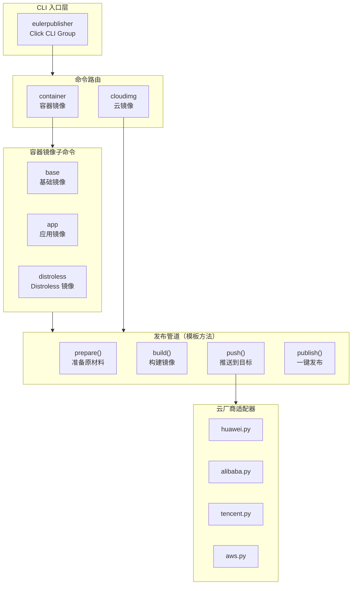
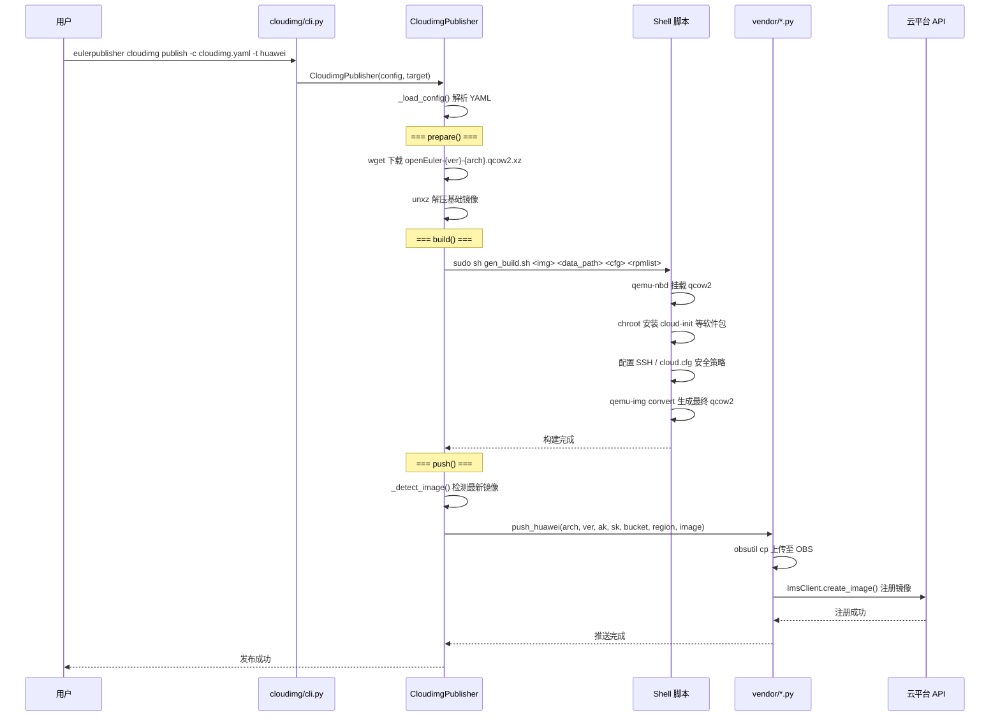
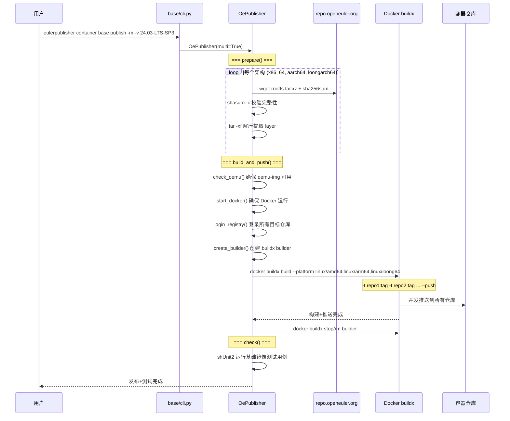
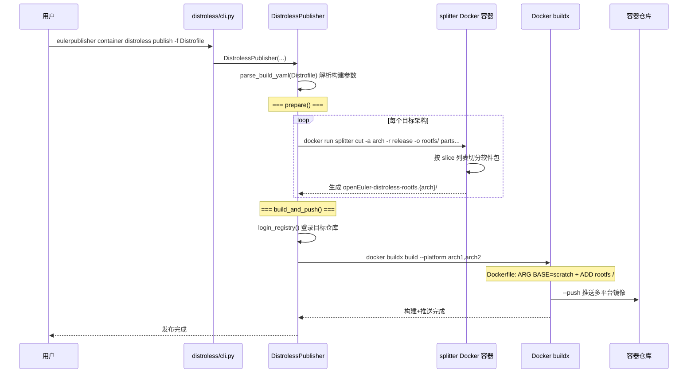
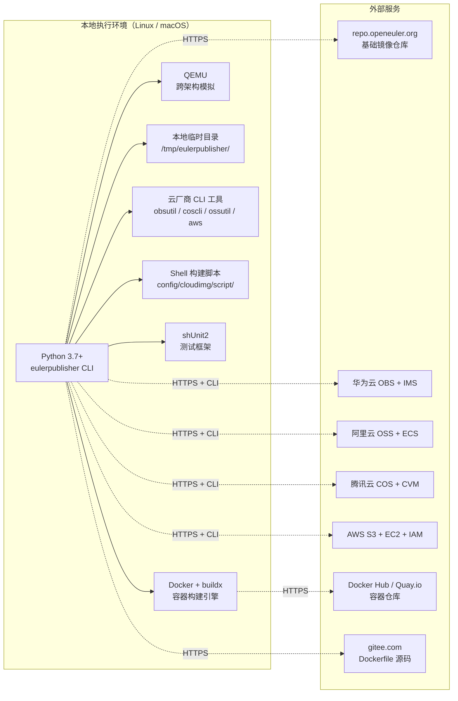

# EulerPublisher 发布系统技术设计文档

**状态:** 已发布
**作者:** openEuler Infra SIG
**日期:** 2026-05-26
**版本:** 1.0

---

## 一、系统概述

EulerPublisher 是 openEuler Infra SIG 提供的「一键式」自动构建和发布 openEuler 镜像的 CLI 工具，承载两类核心能力：

1. **云镜像发布** — 在openEuler版本发布后自动完成 openEuler 基础虚拟化镜像下载，定制化构建，推送到华为云、阿里云、腾讯云、AWS 等主流公有云
2. **容器镜像发布** — 多平台基础/应用/Distroless 镜像的构建与多仓库推送

### 1.1 设计原则

- **模板方法模式**: `Publisher` 基类定义发布管道骨架（prepare → build → push → publish），子类实现具体步骤
- **适配器模式**: 各云厂商 SDK 差异通过统一的 `push_{vendor}()` 接口封装，核心流程与厂商无关
- **配置驱动**: 云镜像参数、仓库凭证、标签规范均通过 YAML 配置文件管理，支持环境变量覆盖
- **安全优先**: Docker 登录使用 `--password-stdin` 避免 shell 注入；云服务凭证通过配置文件或环境变量注入，不硬编码
- **命令行优先**: 基于 Click 框架的多级 CLI，支持分步执行和一步发布两种模式

### 1.2 支持的目标平台

| 类别 | 目标 | 说明 |
|------|------|------|
| **公有云** | 华为云、阿里云、腾讯云、AWS | 云镜像构建与注册 |
| **容器仓库** | Docker Hub、Quay.io、hub.oepkgs.net 及自定义 Registry | 容器镜像推送 |
| **架构** | amd64、arm64、loongarch64 | 多平台镜像支持 |

---

## 二、架构设计

| 视图 | 章节 | 关注点 |
|------|------|--------|
| **逻辑视图** | 2.1 | CLI 路由、发布流水线、功能分层 |
| **开发视图** | 2.2 | 代码组织、模块划分、设计模式 |
| **进程视图** | 2.3 | 运行时行为、Shell 编排、外部命令调用 |
| **物理视图** | 2.4 | 部署拓扑、外部依赖、工具链 |
| **场景视图** | 2.5 | 典型用例、用户交互流程 |

### 2.1 逻辑视图（Logical View）

逻辑视图描述 CLI 路由结构和功能分层：



**功能分层说明：**

| 层级 | 职责 | 核心类/文件 |
|------|------|-----------|
| **CLI 入口层** | 顶层命令注册与路由 | `eulerpublisher.py` |
| **命令路由层** | 子命令分组与参数解析 | `container/cli.py`, `cloudimg/cli.py` |
| **发布管道层** | 准备→构建→推送→发布的标准流程 | `Publisher` 基类及其子类 |
| **云厂商适配层** | 各云厂商 SDK 封装与 API 调用 | `vendor/{huawei,alibaba,tencent,aws}.py` |
| **基础设施层** | 日志、配置、Docker 工具函数 | `publisher/` |

### 2.2 开发视图（Development View）

开发视图描述代码的物理组织结构：

```
eulerpublisher/
├── eulerpublisher/
│   ├── eulerpublisher.py              # CLI 入口（Click Group）
│   ├── publisher/
│   │   ├── __init__.py                # 全局配置、Logger、临时目录、URL 常量
│   │   └── publisher.py               # Publisher 基类 + Docker/QEMU 工具函数
│   ├── container/
│   │   ├── cli.py                     # 容器子命令聚合
│   │   ├── base/
│   │   │   ├── cli.py                 # base 子命令定义
│   │   │   └── base.py                # OePublisher（基础镜像发布逻辑）
│   │   ├── app/
│   │   │   ├── cli.py                 # app 子命令定义
│   │   │   └── app.py                 # AppPublisher（应用镜像发布逻辑）
│   │   └── distroless/
│   │       ├── cli.py                 # distroless 子命令定义
│   │       └── distroless.py          # DistrolessPublisher（Distroless 镜像）
│   ├── cloudimg/
│   │   ├── cli.py                     # cloudimg 子命令定义
│   │   ├── cloudimg.py                # CloudimgPublisher（云镜像发布逻辑）
│   │   └── vendor/
│   │       ├── __init__.py
│   │       ├── huawei.py              # 华为云 IMS 适配器
│   │       ├── alibaba.py             # 阿里云 ECS 适配器
│   │       ├── tencent.py             # 腾讯云 CVM 适配器
│   │       └── aws.py                 # AWS EC2 适配器
├── config/
│   ├── cloudimg/
│   │   ├── cloudimg.yaml              # 云镜像发布配置模板
│   │   ├── script/
│   │   │   ├── gen_build.sh           # 通用构建脚本（华为/阿里/腾讯）
│   │   │   ├── aws_build.sh           # AWS 专用构建脚本
│   │   │   └── azure_build.sh         # Azure 构建脚本（预留）
│   │   └── resource/
│   │       ├── install_packages.txt   # 默认预安装软件列表
│   │       ├── openeuler.cfg          # cloud-init 配置
│   │       ├── role-policy.json       # AWS IAM Role 策略
│   │       └── trust-policy.json      # AWS IAM Trust 策略
│   ├── container/
│   │   ├── base/
│   │   │   ├── registry.yaml          # 基础镜像多仓库配置
│   │   │   └── tags.yaml              # oEEP-0005 标签别名表
│   │   ├── app/
│   │   │   └── registry.yaml          # 应用镜像多仓库配置
│   │   ├── distroless/
│   │   │   ├── Dockerfile             # Distroless 默认 Dockerfile
│   │   │   └── registry.yaml          # Distroless 多仓库配置
│   │   └── wsl/
│   │       └── template.json          # WSL 发布模板（预留）
├── tests/
│   └── container/
│       ├── base/openeuler_test.sh     # 基础镜像测试用例
│       ├── app/*_test.sh              # 应用镜像测试用例
│       └── common/
│           ├── common_funs.sh         # shUnit2 通用函数
│           └── common_vars.sh         # shUnit2 通用变量
├── update/
│   ├── container/                     # 镜像更新辅助脚本
│   └── image/build.sh                # 镜像构建辅助脚本
├── setup.py / setup.cfg              # Python 打包配置（pbr）
├── requirements.txt                  # Python 依赖
├── install.sh / uninstall.sh         # 一键安装/卸载
└── README.md
```

**模块依赖关系：**

```
                    ┌──────────┐
                    │   CLI    │ (Click 路由)
                    └────┬─────┘
           ┌─────────────┼─────────────┐
           ▼             ▼             
    ┌────────────┐ ┌──────────┐ 
    │ container  │ │ cloudimg │ 
    │  /base     │ │          │ 
    │  /app      │ │          │ 
    │  /distroless│ │          │ 
    └─────┬──────┘ └────┬─────┘ 
          │             │            
          └─────────────┼────────────┘
                        ▼
              ┌─────────────────┐
              │   publisher/    │
              │  · __init__.py  │  ← Logger, EP_PATH, URL 常量
              │  · publisher.py │  ← Publisher 基类, Docker 工具
              └────────┬────────┘
                       │
          ┌────────────┼────────────┐
          ▼            ▼            
   ┌───────────┐ ┌──────────┐ 
   │  vendor/  │ │ Shell    │ 
   │  huawei   │ │ 脚本     │ 
   │  alibaba  │ │          │ 
   │  tencent  │ │          │ 
   │  aws      │ │          │ 
   └───────────┘ └──────────┘ 
```

**关键设计模式：**

| 模式 | 应用场景 | 说明 |
|------|---------|------|
| **模板方法** | `Publisher` 基类定义 `prepare/building/push/publish` 骨架，4 个子类实现具体逻辑 | 核心架构模式 |
| **适配器** | `vendor/` 目录统一 `push_{vendor}()` 接口，封装各云厂商 SDK 差异 | 新增厂商仅需添加适配器 |
| **策略模式** | 多仓库发布通过 `registry.yaml` 驱动，运行时根据 `multi` 参数切换单仓库/多仓库策略 | 发布目标可配置化 |
| **工厂方法** | `push_functions` 字典根据 target 参数动态选择云厂商适配器 | `cloudimg.py:push()` |
| **命令模式** | Click 框架的 `@group.command()` 将每个操作封装为独立命令 | CLI 路由 |

### 2.3 进程视图（Process View）

进程视图描述关键工作流的运行时行为：

#### 2.3.1 云镜像一键发布流程



#### 2.3.2 基础容器镜像多仓库发布流程



#### 2.3.3 Distroless 镜像发布流程



### 2.4 物理视图（Physical View）

物理视图描述系统的部署拓扑和外部依赖：



**部署说明：**

| 组件 | 位置 | 说明 |
|------|------|------|
| **eulerpublisher CLI** | 本地 Python 环境 | pip 安装或源码安装 |
| **Docker + buildx** | 本地 | >= 19.03，多平台镜像构建引擎 |
| **QEMU** | 本地 | 支持跨架构容器构建 |
| **云厂商 CLI** | 本地 `/usr/local/bin/` | obsutil / coscli / ossutil / aws |
| **shUnit2** | 本地 `/usr/share/shunit2/` | 容器镜像自动化测试 |
| **基础镜像** | `repo.openeuler.org` | openEuler 官方镜像分发 |
| **云平台 API** | 各厂商云端 | 镜像上传 + 注册 |

**网络要求：**

| 方向 | 目标 | 协议 | 用途 |
|------|------|------|------|
| 本地 → 远程 | repo.openeuler.org:443 | HTTPS | 下载基础镜像 / rootfs |
| 本地 → 远程 | 云厂商对象存储 / API | HTTPS | 上传云镜像 + 注册 |
| 本地 → 远程 | 容器仓库 Registry | HTTPS | 推送容器镜像 |
| 本地 → 远程 | gitee.com:443 | HTTPS | 下载 Dockerfile 源码 |

### 2.5 场景视图（Scenarios / Use Cases）

场景视图通过典型用例串联上述 4 个视图：

#### 场景 1：openEuler 基础容器镜像版本发布

```
运维人员执行：
  export LOGIN_USERNAME="xxx"
  export LOGIN_PASSWORD="xxx"
  eulerpublisher container base publish \
    -p openeuler/openeuler \
    -v 24.03-LTS-SP3 \
    -g docker.io \
    -f custom.Dockerfile

    │
    ├─► OePublisher 初始化
    │     ├── 解析版本号、仓库地址、Dockerfile 路径
    │     └── 从 tags.yaml 加载标签别名（24.03-LTS-SP3 → latest, 24.03）
    │
    ├─► prepare() 下载原材料
    │     ├── 从 repo.openeuler.org 下载 amd64/arm64/loongarch64 的 rootfs
    │     ├── SHA256 校验完整性
    │     └── 解压提取 layer.tar → xz 压缩为 rootfs.tar.xz
    │
    ├─► build_and_push() 构建并推送
    │     ├── 检查 QEMU → 启动 Docker → 登录 Registry → 创建 buildx builder
    │     ├── docker buildx build --platform linux/amd64,linux/arm64,linux/loong64
    │     │     -t docker.io/openeuler/openeuler:24.03-lts-sp3
    │     │     -t docker.io/openeuler/openeuler:latest
    │     │     -t docker.io/openeuler/openeuler:24.03
    │     │     --push .
    │     └── 清理 buildx builder
    │
    └─► check() 执行功能测试
          └── shUnit2 运行 tests/container/base/openeuler_test.sh
                验证基础命令可用性、包管理器正常工作等
```

#### 场景 2：云镜像一键发布到 AWS

```
运维人员执行：
  编辑 config/cloudimg/cloudimg.yaml
    version: "24.03-LTS-SP3"
    arch: "x86_64"
    targets:
      aws:
        ak: "AKIA..."
        sk: "..."
        bucket: "openeuler-images"
        region: "us-east-1"

  eulerpublisher cloudimg publish -c config/cloudimg/cloudimg.yaml -t aws

    │
    ├─► prepare()
    │     └── 从 repo.openeuler.org 下载 openEuler-24.03-LTS-SP3-x86_64.qcow2.xz
    │         解压得到 .qcow2
    │
    ├─► build()
    │     └── sudo sh config/cloudimg/script/aws_build.sh
    │           ├── qemu-nbd 挂载 qcow2
    │           ├── chroot 安装 cloud-init + 预装软件
    │           ├── AWS 特定安全配置
    │           └── qemu-img convert → RAW 格式
    │
    └─► push()
          └── push_aws() in vendor/aws.py
                ├── aws s3 cp 上传至 S3
                ├── boto3 IAM: 创建/更新 vmimport 角色和策略
                ├── boto3 EC2: import_snapshot() 导入快照
                ├── 轮询快照导入状态直至 completed
                └── boto3 EC2: register_image() 注册 AMI
                      最终生成: openEuler-24.03-LTS-SP3-x86_64 (AMI)
```

#### 场景 3：多仓库批量发布基础镜像

```
运维人员执行：
  export EP_LOGIN_FILE=/path/to/custom_registry.yaml
  eulerpublisher container base publish -v 24.03-LTS-SP3 -m

  其中 custom_registry.yaml 内容:
    docker.io:
      - LOGIN_DOCKER_USER
      - LOGIN_DOCKER_PASSWD
      - docker.io/openeuler/openeuler
    quay.io:
      - LOGIN_QUAY_USER
      - LOGIN_QUAY_PASSWD
      - quay.io/openeuler/openeuler

    │
    ├─► login_registry(registry="", multi="custom_registry.yaml")
    │     ├── docker login --username $LOGIN_DOCKER_USER --password-stdin docker.io
    │     └── docker login --username $LOGIN_QUAY_USER --password-stdin quay.io
    │
    ├─► _get_tags(multi="custom_registry.yaml")
    │     对每个仓库生成标签:
    │       docker.io/openeuler/openeuler:24.03-lts-sp3
    │       docker.io/openeuler/openeuler:latest
    │       quay.io/openeuler/openeuler:24.03-lts-sp3
    │       quay.io/openeuler/openeuler:latest
    │
    └─► docker buildx build ... --push
          所有标签一次性构建并推送，无需逐仓库操作
```

#### 场景 4：应用镜像跨仓库同步

```
用户执行：
  eulerpublisher container app publish \
    -p openeuler/cann \
    -f Dockerfile.cann \
    -t cann8.0.0-oe2403 \
    -l true \
    -s "docker.io/openeuler/cann:cann8.0.0-oe2403" \
    -m

    │
    ├─► copy_and_push(source="docker.io/openeuler/cann:cann8.0.0-oe2403")
    │     │
    │     ├─► 登录所有目标仓库
    │     │
    │     ├─► docker buildx imagetools create
    │     │     -t docker.io/openeuler/cann:cann8.0.0-oe2403
    │     │     -t docker.io/openeuler/cann:latest
    │     │     docker.io/openeuler/cann:cann8.0.0-oe2403-amd64
    │     │     docker.io/openeuler/cann:cann8.0.0-oe2403-arm64
    │     │     → 将两个单架构镜像合并为多架构 manifest list
    │     │
    │     └─► regctl image copy 同步到其他仓库
    │           docker.io/openeuler/cann:cann8.0.0-oe2403
    │           → quay.io/openeuler/cann:cann8.0.0-oe2403
    │           → hub.oepkgs.net/openeuler/cann:cann8.0.0-oe2403
```

---

## 三、模块详设

### 3.1 Publisher 基类与公共基础设施

```
eulerpublisher/publisher/
├── __init__.py    # 全局配置 + Logger + 临时目录 + URL 常量
└── publisher.py   # Publisher 基类 + Docker/QEMU/下载工具函数
```

**Publisher 基类** ([publisher/publisher.py](file:///Users/zhengzhenyu/work/codes/gitcode/eulerpublisher/eulerpublisher/publisher/publisher.py#L130-L153))

定义了发布管道的标准接口：

```python
class Publisher:
    def prepare()        # 准备阶段：下载原材料
    def build()          # 构建阶段：生成镜像
    def push()           # 推送阶段：上传到目标仓库
    def build_and_push() # 构建+推送联合（用于 multi-platform 镜像）
    def publish()        # 一键发布 = prepare + build + push
```

**继承树：**

```
Publisher（抽象基类）
├── CloudimgPublisher       # 云镜像发布 → cloudimg.py
├── OePublisher             # 基础容器镜像 → container/base/base.py
├── AppPublisher            # 应用容器镜像 → container/app/app.py
└── DistrolessPublisher     # Distroless 镜像 → container/distroless/distroless.py
```

**公共工具函数 [publisher/publisher.py](file:///Users/zhengzhenyu/work/codes/gitcode/eulerpublisher/eulerpublisher/publisher/publisher.py#L24-L127)：**

| 函数 | 功能 | 关键设计 |
|------|------|---------|
| `start_docker()` | 启动 Docker 守护进程 | 支持 Darwin/Linux，超时 300 秒，每 5 秒重试 |
| `download(url)` | 带重试的 wget 下载 | 最多重试 10 次，每次间隔 5 秒 |
| `check_qemu()` | 校验 qemu-img 是否可用 | 不可用时提示安装命令 |
| `create_builder()` | 创建 docker buildx builder | 名称包含时间戳，每次创建独立实例 |
| `login_registry()` | 登录 Docker Registry | 使用 `--password-stdin` 避免 shell 注入；支持单/多仓库 |
| `_docker_login()` | 子进程安全登录 | Popen stdin 管道传递密码 |

**全局配置 [publisher/__init__.py](file:///Users/zhengzhenyu/work/codes/gitcode/eulerpublisher/eulerpublisher/publisher/__init__.py)：**

| 变量 | 说明 |
|------|------|
| `EP_PATH` | 多路径回退查找配置文件目录 |
| `EP_TMP_DIR` | 临时目录，程序退出自动清理 |
| `EP_LOG_DIR` | 日志目录，默认 `/tmp/` |
| `OPENEULER_REPO` | `https://repo.openeuler.org/` |
| `AVAILABLE_ARCHES` | `{x86_64: amd64, aarch64: arm64, loongarch64: loong64}` |

### 3.2 容器镜像发布模块

#### 3.2.1 基础容器镜像 ([container/base/base.py](file:///Users/zhengzhenyu/work/codes/gitcode/eulerpublisher/eulerpublisher/container/base/base.py))

**OePublisher** 负责 openEuler 基础镜像的完整发布流程：

```
prepare():
  for arch in [x86_64, aarch64, loongarch64]:
      下载 rootfs tar.xz → SHA256 校验 → 解压提取 layer → 重新 xz 压缩

build_and_push():
  check_qemu() → start_docker() → login_registry() → create_builder()
  docker buildx build --platform linux/amd64,linux/arm64,linux/loong64 \
      -t registry/repo:version -t registry/repo:latest ... \
      --push .

publish():
  prepare() → build_and_push() → check()
```

**标签管理** — 通过 [tags.yaml](file:///Users/zhengzhenyu/work/codes/gitcode/eulerpublisher/config/container/base/tags.yaml) 配置：

```yaml
24.03-LTS-SP3:
  - latest
  - 24.03
22.03-LTS-SP4:
  - 22.03
```

构建时自动为每个版本生成别名标签。

#### 3.2.2 应用容器镜像 ([container/app/app.py](file:///Users/zhengzhenyu/work/codes/gitcode/eulerpublisher/eulerpublisher/container/app/app.py))

**AppPublisher** 支持两种发布模式：

1. **build_and_push()** — 从 Dockerfile 构建多平台镜像并推送
2. **copy_and_push(source)** — 从源仓库同步已有镜像到其他仓库，不重复构建

```python
# 模式 1: 构建+推送
obj.build() → docker buildx build --platform ... --push

# 模式 2: 镜像同步
obj.copy_and_push(source)
  → docker buildx imagetools create 合并单架构 → 多架构 manifest
  → regctl image copy 同步到多个目标仓库
```

**数据流：**
```
单架构镜像 (amd64) ─┐
                    ├─► buildx imagetools create ─► 多架构 manifest list
单架构镜像 (arm64) ─┘                                    │
                                              ┌─────────┼─────────┐
                                              ▼         ▼         ▼
                                         Docker Hub  Quay.io   hub.oepkgs
```

#### 3.2.3 Distroless 镜像 ([container/distroless/distroless.py](file:///Users/zhengzhenyu/work/codes/gitcode/eulerpublisher/eulerpublisher/container/distroless/distroless.py))

**DistrolessPublisher** 与 openEuler [splitter](https://gitee.com/openeuler/splitter) 工具集成：

```
prepare():
  for arch in platforms:
      docker run splitter cut -a arch -r release -o rootfs/ slice1 slice2 ...
      → 生成 openEuler-distroless-rootfs.{arch}/

build(op="push"):
  docker buildx build --platform linux/amd64,linux/arm64
      --build-arg BASE=scratch
      -t registry/repo:tag
      --push .
```

**Distrofile 格式：**
```yaml
name: distroless-hello
summary: summary for `hello` image
base: scratch
release: 24.03-LTS
platforms:
  - linux/amd64
  - linux/arm64
parts:
  - slice1
  - slice2
```

**Dockerfile** ([config/container/distroless/Dockerfile](file:///Users/zhengzhenyu/work/codes/gitcode/eulerpublisher/config/container/distroless/Dockerfile))：
```dockerfile
ARG BASE=scratch
FROM ${BASE}
ARG TARGETARCH
ADD openEuler-distroless-rootfs.$TARGETARCH /
```

### 3.3 云镜像发布模块

#### 3.3.1 CloudimgPublisher ([cloudimg/cloudimg.py](file:///Users/zhengzhenyu/work/codes/gitcode/eulerpublisher/eulerpublisher/cloudimg/cloudimg.py))

**核心流程：**

```python
class CloudimgPublisher(Publisher):
    def __init__(self, config_file, target):
        self.config = _load_config(config_file)  # 解析 YAML
        # 读取 version, arch, rpmlist
        # 读取 targets[target] 的 ak/sk/bucket/region

    def prepare():
        下载 → 解压 openEuler-{ver}-{arch}.qcow2.xz

    def build():
        sudo sh {build_script}  <path> <cfg> <rpmlist>
        # gen_build.sh:  通用脚本（华为/阿里/腾讯）
        # aws_build.sh:  AWS 专用脚本（RAW 格式）
        # azure_build.sh: Azure 专用脚本（VHD 格式，预留）

    def push():
        image = _detect_image()  # 自动检测最新镜像
        push_functions[target](...)  # 调用厂商适配器
```

**构建脚本** ([config/cloudimg/script/gen_build.sh](file:///Users/zhengzhenyu/work/codes/gitcode/eulerpublisher/config/cloudimg/script/gen_build.sh))：

```bash
qemu-nbd -c /dev/nbd0 <qcow2>     # 挂载 qcow2 为块设备
mount /dev/nbd0p2 /mnt/nbd0       # 挂载根分区
chroot /mnt/nbd0 yum install ...  # 安装 cloud-init 和预装软件
# 配置 SSH 安全策略
# 配置 cloud-init 禁用 root / 启用密码认证
qemu-img convert → 最终 qcow2     # 压缩转换
```

#### 3.3.2 云厂商适配器 ([cloudimg/vendor/](file:///Users/zhengzhenyu/work/codes/gitcode/eulerpublisher/eulerpublisher/cloudimg/vendor/))

每个适配器暴露统一的 `push_{vendor}(arch, version, ak, sk, bucket, region, image)` 接口：

| 适配器 | SDK | 存储上传 | 镜像注册 | 特殊处理 |
|--------|-----|---------|---------|---------|
| **huawei.py** | `huaweicloudsdkims` | `obsutil cp` → OBS | `ImsClient.create_image()` | — |
| **alibaba.py** | `alibabacloud_ecs20140526` | `ossutil cp` → OSS | `EcsClient.import_image()` | 需配置 `AliyunECSImageImportDefaultRole` |
| **tencent.py** | `tencentcloud-sdk-python-cvm` | `coscli cp` → COS | `CvmClient.ImportImage()` | `OsType="Other Linux"`, `Force=True` |
| **aws.py** | `boto3` | `aws s3 cp` → S3 | `import_snapshot()` → `register_image()` | 需维护 IAM `vmimport` 角色；轮询快照导入状态 |

**AWS 适配器特殊流程：**
```
上传 S3 → 创建/更新 vmimport IAM 角色 → 动态生成 role-policy（注入 bucket 名）
→ import_snapshot() → 轮询 status 直至 "completed"
→ 获取 SnapshotId → register_image() 注册 AMI
```

---

## 四、配置系统

```
config/
├── cloudimg/
│   └── cloudimg.yaml          # 云镜像发布：版本/架构/AK-SK/region
├── container/
│   ├── base/
│   │   ├── registry.yaml      # 多仓库凭证映射（环境变量名 → repo 路径）
│   │   └── tags.yaml          # oEEP-0005 标签别名
│   ├── app/registry.yaml      # 应用镜像多仓库配置
│   └── distroless/
│       ├── registry.yaml      # Distroless 多仓库配置
│       └── Dockerfile         # 默认 Distroless Dockerfile
```

**环境变量覆盖机制：**

| 环境变量 | 用途 | 默认值 |
|---------|------|--------|
| `LOGIN_USERNAME` | Docker Registry 登录用户名（单仓库模式） | 必填 |
| `LOGIN_PASSWORD` | Docker Registry 登录密码（单仓库模式） | 必填 |
| `EP_LOGIN_FILE` | 多仓库发布时的 registry.yaml 路径 | `config/container/{type}/registry.yaml` |
| `EP_TMP_DIR` | 自定义临时目录（不自动清理） | `tempfile.mkdtemp()` （自动清理） |
| `EP_LOG_DIR` | 日志文件目录 | `/tmp/` |
| `EP_DISTROLESS_WORKDIR` | Distroless 构建工作目录 | Distrofile 所在目录 |
| `EP_APP_WORKDIR` | 应用镜像构建工作目录 | Dockerfile 所在目录 |

---

## 五、数据流说明

### 5.1 云镜像发布数据流

```
cloudimg.yaml 配置
    │
    ▼
┌─────────────────────────────────────────────────────────────┐
│ prepare()                                                   │
│   repo.openeuler.org/openEuler-{ver}/virtual_machine_img/   │
│   → 下载 .qcow2.xz → 解压 → .qcow2                          │
│   输出: /tmp/eulerpublisher/cloudimg/data/{img}.qcow2       │
└─────────────────────────────────────────────────────────────┘
    │
    ▼
┌─────────────────────────────────────────────────────────────┐
│ build()                                                     │
│   Shell 脚本: qemu-nbd 挂载 → chroot 安装软件 → 安全配置    │
│   输出: /tmp/eulerpublisher/cloudimg/data/output/            │
│         openEuler-{ver}-{arch}-{timestamp}.qcow2            │
└─────────────────────────────────────────────────────────────┘
    │
    ▼
┌─────────────────────────────────────────────────────────────┐
│ push()                                                      │
│   _detect_image() 自动检测最新 .qcow2                        │
│   → 云厂商 CLI 上传至对象存储                                │
│   → 云厂商 SDK 注册为平台镜像                                │
│   最终镜像名: openEuler-{VERSION}-{ARCH}                     │
└─────────────────────────────────────────────────────────────┘
```

### 5.2 基础容器镜像发布数据流

```
命令行参数: -v {version} -p {repo} -g {registry} [-m]
    │
    ▼
┌─────────────────────────────────────────────────────────────┐
│ prepare()                                                   │
│   for arch in [x86_64, aarch64, loongarch64]:               │
│     repo.openeuler.org/openEuler-{ver}/docker_img/{arch}/   │
│     → 下载 .tar.xz → SHA256 校验 → tar -xf → 提取 layer.tar │
│     → xz -z rootfs.tar                                      │
│   输出: /tmp/eulerpublisher/container/base/{ver}/            │
│         openEuler-docker-rootfs.{amd64|arm64|loong64}.tar.xz │
└─────────────────────────────────────────────────────────────┘
    │
    ▼
┌─────────────────────────────────────────────────────────────┐
│ build_and_push()                                            │
│   check_qemu() → start_docker() → login_registry()          │
│   tags.yaml: {ver: [aliases...]} → 生成 tag 列表             │
│   registry.yaml (多仓库模式): 读取目标仓库                   │
│   docker buildx build --platform {platforms}                 │
│     -t {registry1}/{repo}:{tag} -t {registry2}/{repo}:{tag} │
│     --push .                                                 │
│   输出: 多平台 manifest list 已推送到各 Registry              │
└─────────────────────────────────────────────────────────────┘
    │
    ▼
┌─────────────────────────────────────────────────────────────┐
│ check() （publish 流程包含）                                 │
│   shUnit2 tests/container/base/openeuler_test.sh            │
│   输出: 测试通过 / 测试失败                                  │
└─────────────────────────────────────────────────────────────┘
```

### 5.3 Distroless 镜像发布数据流

```
Distrofile (YAML) 配置
    │
    ▼
┌─────────────────────────────────────────────────────────────┐
│ prepare()                                                   │
│   for arch in platforms:                                    │
│     docker run splitter cut -a {arch} -r {release}         │
│       -o {workdir}/openEuler-distroless-rootfs.{arch}/      │
│       {parts...}                                            │
│   输出: {workdir}/openEuler-distroless-rootfs.{arch}/       │
└─────────────────────────────────────────────────────────────┘
    │
    ▼
┌─────────────────────────────────────────────────────────────┐
│ build_and_push()                                            │
│   login_registry()                                          │
│   docker buildx build --platform {platforms}                 │
│     --build-arg BASE={base_scratch}                         │
│     -t {registry}/{repo}:{tag}                              │
│     --push .                                                 │
│   Dockerfile: FROM scratch + ADD rootfs → 最终镜像           │
└─────────────────────────────────────────────────────────────┘
```

### 5.4 应用镜像镜像同步数据流

```
源镜像: docker.io/openeuler/cann:cann8.0.0-oe2403
    │
    ▼
┌─────────────────────────────────────────────────────────────┐
│ copy_and_push(source)                                       │
│   1. 登录所有目标仓库                                        │
│   2. docker buildx imagetools create                        │
│        -t docker.io/openeuler/cann:cann8.0.0-oe2403         │
│        docker.io/openeuler/cann:cann8.0.0-oe2403-amd64      │
│        docker.io/openeuler/cann:cann8.0.0-oe2403-arm64      │
│      → 创建多架构 manifest list                              │
│   3. regctl image copy source → dest                        │
│      docker.io/... → quay.io/... → hub.oepkgs.net/...       │
└─────────────────────────────────────────────────────────────┘
```

---

## 六、性能设计

### 6.1 性能特征

EulerPublisher 的性能瓶颈主要在于：

| 环节 | 耗时因素 | 典型耗时 |
|------|---------|---------|
| **基础镜像下载** | 网络带宽 + 镜像大小 (~500MB) | 1-5 分钟 |
| **云镜像构建** | qemu-img 格式转换 | 1-3 分钟 |
| **容器镜像构建** | buildx 多平台编译 + 推送 | 2-10 分钟 |
| **云镜像上传** | 对象存储上传带宽 | 2-10 分钟 |

### 6.2 优化策略

| 策略 | 说明 |
|------|------|
| **下载重试** | `download()` 最多重试 10 次，每次间隔 5 秒，应对网络波动 |
| **缓存复用** | 基础镜像 rootfs 下载后保留在临时目录，重复构建无需重新下载 |
| **多仓库并行推送** | `docker buildx build --push` 一次构建同步推送到所有仓库 |
| **buildx builder 复用** | 构建完成后自动停止并删除 builder，避免资源泄漏 |

---

## 七、安全设计

### 7.1 凭证保护

| 敏感信息 | 保护方式 | 说明 |
|---------|---------|------|
| **Docker Registry 密码** | `--password-stdin` | 子进程 Popen stdin 管道传递，避免出现在进程列表和 shell 历史中 |
| **云厂商 AK/SK** | YAML 配置文件 | 集中管理于 `cloudimg.yaml`，不入库（通过 `.gitignore` 排除用户修改后的文件） |
| **AWS IAM 策略** | 运行时动态生成 | 根据用户指定的 bucket 名动态注入 `role-policy.json`，存储在临时目录 |

### 7.2 输入验证

| 验证点 | 实现 |
|--------|------|
| **架构校验** | `CloudimgPublisher.__init__()` 检查配置中的 `arch` 与 `platform.machine()` 一致 |
| **QEMU 可用性** | `build_and_push()` 执行前调用 `check_qemu()` |
| **Docker 可用性** | `start_docker()` 循环检测直至成功或超时 |
| **文件完整性** | `OePublisher.prepare()` 下载后执行 `shasum -c` 校验 |
| **云厂商 target 格式** | `push()` 中检查 target 是否在 `push_functions` 字典中 |
| **Dockerfile 存在性** | 基础镜像 Dockerfile 不存在时自动从 gitee 下载最新版 |

### 7.3 异常处理

| 异常类型 | 处理方式 | 影响范围 |
|---------|---------|---------|
| **下载失败** | `download()` 10 次重试，失败返回 `PUBLISH_FAILED` | 当前架构 |
| **SHA256 校验失败** | 立即返回 `PUBLISH_FAILED` | 当前架构 |
| **Docker 启动超时** | 300 秒超时，提示手动启动 | 整个流程 |
| **buildx build 失败** | 捕获 `CalledProcessError`，清理 builder | 整个流程 |
| **云厂商 API 异常** | 抛出 `ClickException` 并包含厂商名称 | 当前厂商 |

---

## 八、技术选型

### 8.1 核心依赖

| 技术 | 用途 | 说明 |
|------|------|------|
| **Python 3.7+** | 主开发语言 | `setup.cfg` 声明的运行环境 |
| **Click** | CLI 框架 | 多级命令路由、参数校验、帮助文档自动生成 |
| **PyYAML** | 配置文件解析 | cloudimg.yaml / registry.yaml / tags.yaml / init.yaml |
| **docker-py** | Docker SDK（依赖项） | 与 Docker 守护进程交互 |
| **wget** (Python 库) | 文件下载 | 带重试机制的下载 |
| **boto3** | AWS SDK | EC2 / IAM / S3 操作 |
| **huaweicloudsdkims** | 华为云 IMS SDK | 镜像注册 |
| **alibabacloud_ecs20140526** | 阿里云 ECS SDK | 镜像导入 |
| **tencentcloud-sdk-python-cvm** | 腾讯云 CVM SDK | 镜像导入 |
| **pbr** | Python 打包 | setup.py 声明 `pbr=True` 管理版本和元数据 |
| **requests / bs4 / gitpython** | HTTP / HTML / Git 操作 | 辅助工具 |
| **certifi** | SSL 证书 | HTTPS 请求依赖 |

### 8.2 外部工具依赖

| 工具 | 用途 | 安装方式 |
|------|------|---------|
| **Docker (>= 19.03)** | 容器构建引擎 | `yum install docker` |
| **docker buildx** | 多平台镜像构建 | Docker 内置或独立安装 |
| **QEMU** | 跨架构模拟 | `yum install qemu-img` |
| **AWS CLI** | S3 上传 | `install.sh` 自动安装 |
| **obsutil** | 华为云 OBS 上传 | `install.sh` 自动安装 |
| **coscli** | 腾讯云 COS 上传 | `install.sh` 自动安装 |
| **ossutil** | 阿里云 OSS 上传 | `install.sh` 自动安装 |
| **shUnit2** | 容器镜像测试 | `install.sh` 自动安装 |

---

## 九、目录结构

```
eulerpublisher/
├── eulerpublisher/                     # Python 源码
│   ├── eulerpublisher.py               # CLI 入口（Click Group 注册）
│   ├── publisher/
│   │   ├── __init__.py                 # 全局配置、Logger、URL 常量、架构映射
│   │   └── publisher.py                # Publisher 基类 + Docker/QEMU/下载工具函数
│   ├── container/
│   │   ├── cli.py                      # 容器镜像子命令路由
│   │   ├── base/
│   │   │   ├── cli.py                  # base 子命令（prepare/check/push/publish）
│   │   │   └── base.py                 # OePublisher 基础镜像发布逻辑
│   │   ├── app/
│   │   │   ├── cli.py                  # app 子命令（build/push/check/publish）
│   │   │   └── app.py                  # AppPublisher 应用镜像发布逻辑
│   │   └── distroless/
│   │       ├── cli.py                  # distroless 子命令（build/publish）
│   │       └── distroless.py           # DistrolessPublisher + splitter 集成
│   ├── cloudimg/
│   │   ├── cli.py                      # cloudimg 子命令（prepare/build/push/publish）
│   │   ├── cloudimg.py                 # CloudimgPublisher 云镜像发布逻辑
│   │   └── vendor/
│   │       ├── __init__.py
│   │       ├── huawei.py               # push_huawei() — 华为云 IMS
│   │       ├── alibaba.py              # push_alibaba() — 阿里云 ECS
│   │       ├── tencent.py              # push_tencent() — 腾讯云 CVM
│   │       └── aws.py                  # push_aws() — AWS EC2 + IAM
├── config/                             # 配置文件
│   ├── cloudimg/
│   │   ├── cloudimg.yaml               # 云镜像发布配置模板
│   │   ├── script/                     # 云镜像构建 Shell 脚本
│   │   │   ├── gen_build.sh            # 通用构建脚本（华为/阿里/腾讯）
│   │   │   ├── aws_build.sh            # AWS 专用构建脚本（RAW 格式）
│   │   │   └── azure_build.sh          # Azure 构建脚本（预留）
│   │   └── resource/
│   │       ├── install_packages.txt    # 默认预安装软件列表
│   │       ├── openeuler.cfg           # cloud-init 配置
│   │       ├── role-policy.json        # AWS IAM Role 策略模板
│   │       └── trust-policy.json       # AWS IAM Trust 策略
│   ├── container/
│   │   ├── base/
│   │   │   ├── registry.yaml           # 基础镜像多仓库登录信息
│   │   │   └── tags.yaml               # oEEP-0005 标签别名
│   │   ├── app/
│   │   │   └── registry.yaml           # 应用镜像多仓库配置
│   │   ├── distroless/
│   │   │   ├── Dockerfile              # Distroless 默认 Dockerfile
│   │   │   └── registry.yaml           # Distroless 多仓库配置
│   │   └── wsl/
│   │       └── template.json           # WSL 微软商店发布模板（预留）
├── tests/
│   └── container/
│       ├── base/openeuler_test.sh      # 基础镜像 shUnit2 测试
│       ├── app/*_test.sh               # 应用镜像测试用例
│       └── common/                     # shUnit2 通用函数/变量
├── update/                             # 镜像更新辅助工具
│   ├── container/
│   │   ├── app/build.sh, push.sh, update.py, format.py
│   │   ├── base/build.sh, update.py
│   │   ├── distroless/build.sh, update.py
│   │   └── pushrm/pushrm.sh
│   └── image/build.sh, update.py
├── docs/
│   ├── design/                         # 设计文档
│   │   ├── PRD-EulerPublisher发布系统.md
│   │   └── ARCHITECTURE-EulerPublisher发布系统.md
│   └── picture/shunit2.png
├── setup.py                            # Python 打包入口（pbr）
├── setup.cfg                           # 包元数据 + entry_points
├── requirements.txt                    # Python 依赖
├── install.sh / uninstall.sh          # 一键安装/卸载
├── LICENSE
└── README.md
```

---

## 十、CLI 命令全集

```
eulerpublisher
├── cloudimg
│   ├── prepare  -c CONFIG
│   ├── build    -c CONFIG -t TARGET
│   ├── push     -c CONFIG -t TARGET
│   └── publish  -c CONFIG -t TARGET
├── container
│   ├── base
│   │   ├── prepare  -v VERSION [-i INDEX]
│   │   ├── check    -t TAG [-s SCRIPT]
│   │   ├── push     -p REPO -v VERSION [-g REGISTRY] [-f DOCKERFILE]
│   │   └── publish  -v VERSION [-p REPO] [-g REGISTRY] [-f DOCKERFILE] [-i INDEX] [-m]
│   ├── app
│   │   ├── build    -p REPO -a ARCH -f DOCKERFILE -t TAG [-g REGISTRY] [-m]
│   │   ├── push     -p REPO -t TAG [-g REGISTRY] [-m]
│   │   ├── check    -t TAG [-n NAME] [-h NAMESPACE] [-s SCRIPT]
│   │   └── publish  -p REPO -f DOCKERFILE -t TAG [-a ARCH] [-g REGISTRY] [-l] [-s SOURCE] [-m]
│   └── distroless
│       ├── build    -p REPO -f DISTROFILE [-t TAG]
│       └── publish  -p REPO -f DISTROFILE [-g REGISTRY] [-t TAG] [-m]
```

---

## 十一、相关文档

- **产品需求文档:** [PRD-EulerPublisher发布系统.md](./PRD-EulerPublisher发布系统.md)
- 社区规范:
  - [oEEP-0005 openEuler 官方容器镜像发布流程](https://gitee.com/openeuler/TC/blob/master/oEEP/oEEP-0005%20openEuler%E5%AE%98%E6%96%B9%E5%AE%B9%E5%99%A8%E9%95%9C%E5%83%8F%E5%8F%91%E5%B8%83%E6%B5%81%E7%A8%8B.md)
  - [oEEP-0014 openEuler AI 容器镜像软件栈规范](https://gitee.com/openeuler/TC/blob/master/oEEP/oEEP-0014%20openEuler%20AI%E5%AE%B9%E5%99%A8%E9%95%9C%E5%83%8F%E8%BD%AF%E4%BB%B6%E6%A0%88%E8%A7%84%E8%8C%83.md)
- 上游工具:
  - [splitter](https://gitee.com/openeuler/splitter) — openEuler 软件包切分工具
  - [shUnit2](https://github.com/kward/shunit2) — Shell 单元测试框架
