#      			  EulerPublish slim 使用说明

​		 EulerPublish slim包含`lint`、`analyze`、`profile`、`slim`   本文主要进行`analyze` 与`slim`的具体功能解读与产物分析，设计思想与代码实现请参考[EulerPublish slim详细设计](https://uestc.feishu.cn/docx/Guxwdncrxo7YyMx4tmscFEjenWf)。（注：`analyze`与`slim`对应源码中的`Xray`和`build`）

# 											Xray

# 模块介绍

## 概要介绍

`Xray`命令主要用于静态分析 Docker 镜像。它会深入探索 Docker 镜像的各层、使用的命令、文件、库、可执行文件以及当 Docker 镜像构建时将在工作环境中产生的变更。这个命令能够帮助逆向生成 Dockerfile，即从目标 Docker 镜像反推出 Dockerfile。同时，`Xray` 也会提供对象文件的信息，以及容器空间中可能存在的浪费情况。

## 功能介绍

- 生成逆向Dockerfile

 通过调用Docker remote api ` /v1.44/images/{name}/history` 实现`Get the history of an image`。解析镜像的历史信息获取每一层构建指令，并还原出Dockerfile。

- 将镜像导出为tar包

 将docker镜像保存到本地文件系统，并压缩为一个以镜像ID命名的tar包。

- 生成镜像检测报告

 根据镜像的历史信息与层(layer)文件生成镜像报告，静态分析镜像元数据(MetaData)。

# 快速开始

1. **请参考** **[EulerPublish](https://gitee.com/openeuler/eulerpublisher)** **完成工具安装 或 执行如下脚本完成** **`slim`**模块安装

```Shell
curl -sL https://raw.githubusercontent.com/slimtoolkit/slim/master/scripts/install-slim.sh | sudo -E bash -
```

2. **拉取指定测试镜像**

```Shell
docker pull registry.cn-beijing.aliyuncs.com/the_first_ikun/spring:app
```

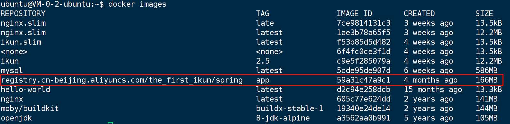

**注：**文档后续内容认以该测试镜像为目标镜像，且文档中出现的该镜像的`SHA256哈希值/镜像ID`默认使用`{ImageId}`替换。`ImageID=59a31c47a9c1c9fec78b40bab702a416ac117faa16f22bddfaa5b09d65ac638e`

3. **镜像分析**

```Shell
slim --log app.log --log-level trace xray 59a31c47a9c1
```

分析完毕后，当前目录下会生成`app.log`与`slim.report.json`

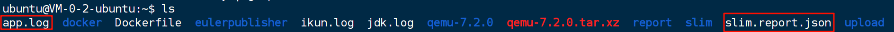

# 模块产物

## 1. slim.report.json

[点击获取](https://ikun111.oss-cn-beijing.aliyuncs.com/slim.report.json)

### 结构分析

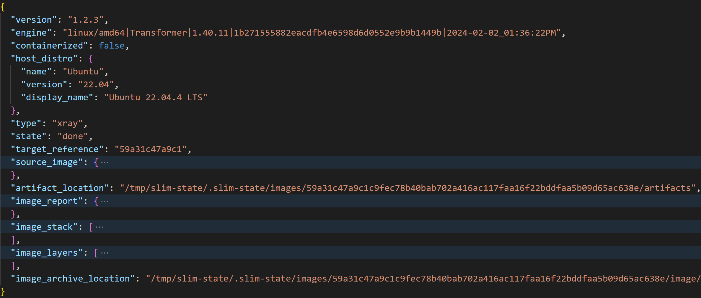

```JSON
├── version: slim的版本号。
├── engine: slim的运行环境信息，包括操作系统、架构、版本、提交哈希值和时间。
├── containerized: 是否在容器环境中运行slim。
├── host_distro: 运行slim的主机操作系统信息，包括名称、版本和显示名称。
├── type: 分析类型，这里是 "xray"，表示对镜像进行静态分析。
├── state: 分析状态，这里是 "done"，表示分析已完成。
├── target_reference: 分析的目标镜像的 ID。
├── source_image: 目标镜像的详细信息，包括：
│   ├── identity: 镜像的标识信息，包括 ID、标签、名称、摘要和完整摘要。
│   ├── size: 镜像的大小，以字节为单位。
│   ├── size_human: 镜像的大小，以人类可读的格式表示。
│   ├── create_time: 镜像创建的时间。
│   ├── docker_version: 构建镜像的 Docker 版本。
│   ├── architecture: 镜像的架构。
│   ├── os: 镜像的操作系统。
│   ├── labels: 镜像的标签信息。
│   ├── env_vars: 镜像中的环境变量。
│   ├── distro: 镜像的操作系统发行版信息，包括名称、版本和显示名称。
│   └── container_entry: 镜像的入口点信息，包括命令、可执行文件路径、完整可执行文件路径、参数和参数文件。
├── artifact_location: 分析产物的存储位置。
├── image_report: 镜像分析报告，包括：
│   ├── stats: 分析统计信息，包括重复文件数量、重复文件总数量、重复文件大小、重复文件总大小、重复文件浪费的大小、删除的文件数量、删除的目录内容数量、删除的目录数量、删除的文件数量、删除的链接数量、删除的文件大小和粘性文件数量。
│   └── duplicates: 重复文件信息，每个重复文件条目包含以下信息：
│       ├── file_count: 该重复文件在镜像中出现的次数。
│       ├── file_size: 该重复文件的大小。
│       ├── all_file_size: 所有重复文件的大小。
│       ├── wasted_size: 该重复文件浪费的大小。
│       └── files: 该重复文件在镜像中的路径信息，以字典形式表示。
├── image_stack: Docker 镜像的层级结构，包含每个镜像层的详细信息
│       ├── is_top_image: 是否为最顶层的镜像
│       ├── id: 镜像层的 ID
│       ├── full_name: 镜像的全名，包括仓库地址、名称和标签
│       ├── repo_name: 镜像仓库地址和名称
│       ├── version_tag: 镜像标签
│       ├── raw_tags: 镜像的所有标签
│       ├── create_time: 镜像创建的时间
│       ├── new_size: 镜像层的大小（字节）
│       ├── new_size_human: 镜像层的大小（人类可读格式）
│       └── instructions: 镜像层的 Dockerfile 指令列表，包含每个指令的详细信息
│           ├── type: 指令类型，例如 ADD、CMD、ENV、RUN、COPY
│           ├── time: 指令执行的时间
│           ├── is_nop: 是否为无操作指令
│           ├── is_exec_form: 是否为执行形式的指令，例如 CMD 指令
│           ├── local_image_exists: 指令执行时，镜像层是否已存在于本地
│           ├── layer_index: 镜像层的索引
│           ├── layer_id: 镜像层的 ID
│           ├── layer_fsdiff_id: 镜像层的差异 ID
│           ├── size: 指令执行后，镜像层的大小（字节）
│           ├── size_human: 指令执行后，镜像层的大小（人类可读格式）
│           ├── params: 指令的参数
│           ├── command_snippet: 指令的代码片段
│           ├── command_all: 指令的完整代码
│           ├── system_commands: 指令执行的系统命令列表
│           ├── inst_set_time_bucket: 指令执行的时间段
│           ├── inst_set_time_index: 指令执行的时间段索引
│           └── inst_set_time_reverse_index: 指令执行的时间段反向索引
├── image_layers: Docker 镜像的层级列表，包含每个镜像层的详细信息
│       ├── id: 镜像层的 ID
│       ├── index: 镜像层的索引
│       ├── path: 镜像层在仓库中的路径
│       ├── fsdiff_id: 镜像层的差异 ID
│       ├── stats: 镜像层的文件系统统计信息
│       ├── changes: 镜像层的文件系统变化信息
│       └── top: 镜像层的文件系统变化列表，包含每个文件或目录的详细信息
```

## 2. Log

[点击获取](https://ikun111.oss-cn-beijing.aliyuncs.com/app.log)

### 结构分析

```Python
前置工作
1 系统信息:记录了系统环境信息，包括操作系统类型、内核版本、主机名等，表明构建过程是在一台运行 Ubuntu 22.04.4 LTS 的 Linux 虚拟机上进行的。
2-5 Docker客户端信息:记录了 Docker 客户端连接到 Docker 守护进程的方式，使用的是 Unix Socket，地址为 /var/run/docker.sock。
6 镜像信息:记录了要分析的镜像信息，包括镜像 ID、标签、仓库地址等。
Slim Inspect（Return low-level information about an image)
7 提示开始分析镜像的元数据。
8 镜像信息：记录了要inspect的镜像的信息
9-16 镜像列表：列出当前主机上可供inspect的镜像的信息
17 开始准备镜像状态目录。
(注：镜像状态目录即为slim xray制品的所在目录:/tmp/slim-state/.slim-state/images/{ImageID}）
18 Slim 工具默认的镜像状态目录位置。
19 镜像状态目录位置覆盖为 /tmp/slim-state。
20 更新了镜像状态目录位置。
21-24 将传感器文件(slim-sensor)复制到镜像状态目录。
25 已经准备好镜像状态目录，并记录了相关路径信息。
    statePrefix=statePath="/tmp/slim-state/"
    stateKey={ImageId} 
    localVolumePath=statePrefix +".slim-state" + "images" + stateKey
    msg="localVolumePath=/tmp/slim-state/.slim-state/images/59a31c47a9c1c9fec78b40bab702a416ac117faa16f22bddfaa5b09d65ac638e, artifactLocation=/tmp/slim-state/.slim-state/images/59a31c47a9c1c9fec78b40bab702a416ac117faa16f22bddfaa5b09d65ac638e/artifacts, statePath=/tmp/slim-state, stateKey=59a31c47a9c1c9fec78b40bab702a416ac117faa16f22bddfaa5b09d65ac638e" 
生成逆向 Dockerfile (Dockerfile From HistoryStruct)
28-40 镜像构建历史(Image History):展示了镜像的构建历史，包含每个构建阶段的 ID、标签、创建时间、构建指令和大小等信息。
镜像的构建历史是从最底层的基础镜像开始，逐层向上构建的。每个构建阶段的 CreatedBy 字段显示了该阶段执行的指令，例如 CMD [\"java\", "-jar", "/my-springboot-app.jar\] 表示该阶段执行了运行 Java 应用程序的指令。
42-62 Dockerfile 指令（IMAGE INSTRUCTIONS）：将 Image History 中的构建指令转化为Dockerfile中的命令
这些指令定义了镜像的构建过程。指令被分成了不同的组，例如 # instruction set group 1 和 # instruction set group 2。
指令的顺序与镜像构建历史的顺序一致。
镜像导出（Export Image）
63 镜像导出到 /tmp/slim-state/.slim-state/images/{ImageId}/image/{ImageId}.tar 文件。
镜像tar包-->Package结构体(LoadPackage)
65 解析 OCI 镜像索引文件 index.json
66 提取了镜像清单文件信息：Digest:\"sha256:6585eb2abae586e65263d7ff269cab4d76fedf2181688f68615fd43e43070633" 是镜像清单文件的哈希值。
67 打印 index.json 内容
68 解析 manifest.json 文件
69 打印 manifest.json 内容
70 解析 oci-layout
71 表示镜像压缩包中包含了 15 个文件，并且成功解析了 Docker 镜像清单、OCI 索引、OCI 布局和 OCI 层文件。
72 镜像压缩包的格式为 OCI，并且是有效的 OCI 镜像
73 从 manifest.json 中获取了镜像配置信息路径("blobs/sha256/{ImageId}")
74 从 manifest.json 中获取了镜像层(Layer)文件的路径
75 再次打印从 OCI 镜像索引中获取了镜像清单文件的路径"blobs/sha256/6585eb2abae586e65263d7ff269cab4d76fedf2181688f68615fd43e43070633"
76-77 解析并加载镜像配置文件 'blobs/sha256/{ImageId}'--> ConfigObject 结构体
78-81 解析并加载镜像清单文件 'blobs/sha256/6585eb2abae586e65263d7ff269cab4d76fedf2181688f68615fd43e43070633'
82-87 save layer：将 manifest.json 中的四个layer hash值对应的镜像层文件保存到结构体中 layers[layerID] = layer
88 输出镜像层队列(layerSequence):Position: 该层在镜像中的顺序位置。Path: 该层在镜像中的路径。LayerID: 该层的唯一标识符（SHA256 哈希值）。
```

## 3. 逆向 Dockerfile

1. **原 Dockerfile**

```Dockerfile
# 使用带有 JDK 8 的 OpenJDK 基础镜像
FROM openjdk:8-jdk-alpine

COPY demo-0.0.1-SNAPSHOT.jar my-springboot-app.jar

CMD ["java", "-jar", "/my-springboot-app.jar"]
```

2. **逆向 Dockerfile**

路径：`/tmp/slim-state/.slim-state/images/{ImageId}/artifacts/Dockerfile.reversed`

```Dockerfile
FROM scratch
# new image
# instruction set group 1
ADD file:a86aea1f3a7d68f6ae03397b99ea77f2e9ee901c5c59e59f76f93adbb4035913 /
CMD ["/bin/sh"]
# instruction set group 2
ENV LANG=C.UTF-8
RUN {           echo '#!/bin/sh';               echo 'set -e';          echo;           echo 'dirname "$(dirname "$(readlink -f "$(which javac || which java)")")"';    } > /usr/local/bin/docker-java-home && \
        chmod +x /usr/local/bin/docker-java-home
ENV JAVA_HOME=/usr/lib/jvm/java-1.8-openjdk
ENV PATH=/usr/local/sbin:/usr/local/bin:/usr/sbin:/usr/bin:/sbin:/bin:/usr/lib/jvm/java-1.8-openjdk/jre/bin:/usr/lib/jvm/java-1.8-openjdk/bin
ENV JAVA_VERSION=8u212
ENV JAVA_ALPINE_VERSION=8.212.04-r0
RUN set -x && \
        apk add --no-cache              openjdk8="$JAVA_ALPINE_VERSION" && \
        [ "$JAVA_HOME" = "$(docker-java-home)" ]
# instruction set group 3
# buildkit.dockerfile.v0 (a buildkit instruction)
COPY demo-0.0.1-SNAPSHOT.jar my-springboot-app.jar
# buildkit.dockerfile.v0 (a buildkit instruction)
CMD ["java","-jar","/my-springboot-app.jar"]
# end of image: registry.cn-beijing.aliyuncs.com/the_first_ikun/spring:app (id:  tags: registry.cn-beijing.aliyuncs.com/the_first_ikun/spring:app)
```

不难看出，逆向Dockerfile除了还原`原 Dockerfile`中的指令(instruction)，还将基础镜像 `openjdk:8-jdk-alpine`内的隐含指令进行解析并还原。读者不妨尝试拉取`openjdk:8-jdk-alpine`镜像并使用 `Slim Xray`进行静态分析，打开基础镜像的`逆向Dockfile`，可以发现其内容与所给`逆向Dockfile`的*1-16* 相同。

## 4. 镜像 tar包

路径：`/tmp/slim-state/.slim-state/images/{ImageId}/images/{ImageId}.tar`

```Shell
tar -tvf {ImageId}.tar //展示tar包结构
```

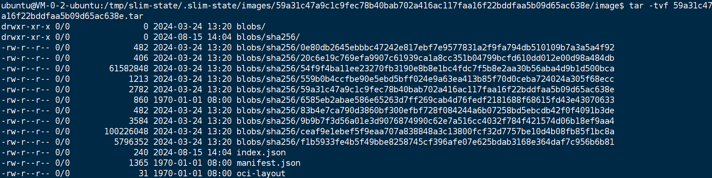

```Shell
OCI（Open Container Initiative）
OCI 规范： OCI 规范定义了一种新的镜像格式，它将镜像分解为多个独立的层（layer），每个层都包含一个或多个文件，并使用哈希值进行标识。
blobs 目录： blobs 目录用于存储这些独立的层内容。
index.json ： index.json 文件包含了镜像的索引信息，包括每个层的哈希值和大小等。
manifest.json ： manifest.json 文件包含了镜像的元数据信息，例如镜像的标签、创建者、架构等。
oci-layout ： oci-layout 文件是一个简单的文本文件，用于标识这是一个 OCI 镜像。
```

### index.json

```JSON
{
    "schemaVersion": 2,//索引文件遵循 OCI 规范的版本 2
    "mediaType": "application/vnd.oci.image.index.v1+json",//表示这是一个 OCI 镜像索引文件，使用 JSON 格式。
    "manifests": [
        {
            "mediaType": "application/vnd.oci.image.manifest.v1+json",
            //指定了清单文件的媒体类型，表示这是一个 OCI 镜像清单文件，使用 JSON 格式。
            "digest": "sha256:6585eb2abae586e65263d7ff269cab4d76fedf2181688f68615fd43e43070633",
            //表示清单文件的 SHA256 哈希值。
            "size": 860
            //表示清单文件的大小，单位是字节。
        }
    ]
}
```

### manifest.json

```JSON
[
    {
        "Config": "blobs/sha256/59a31c47a9c1c9fec78b40bab702a416ac117faa16f22bddfaa5b09d65ac638e",
        //表示镜像的配置信息的储存路径。
        "RepoTags": null,
        "Layers": [
            "blobs/sha256/f1b5933fe4b5f49bbe8258745cf396afe07e625bdab3168e364daf7c956b6b81",
             //镜像第一层的存储路径
            "blobs/sha256/9b9b7f3d56a01e3d9076874990c62e7a516cc4032f784f421574d06b18ef9aa4",
            "blobs/sha256/ceaf9e1ebef5f9eaa707a838848a3c13800fcf32d7757be10d4b08fb85f1bc8a",
            "blobs/sha256/54f9f4ba11ee23270fb3190e8b8e1bc4fdc7f5b8e2aa30b56aba4d9b1d500bca"
        ],
        "LayerSources"://每个层的详细信息。
         {
            "sha256:54f9f4ba11ee23270fb3190e8b8e1bc4fdc7f5b8e2aa30b56aba4d9b1d500bca": {
                "mediaType": "application/vnd.oci.image.layer.v1.tar",
                // 表示该层是一个 TAR 文件。
                "size": 61582848,
                //表示该层的大小，单位是字节。
                "digest": "sha256:54f9f4ba11ee23270fb3190e8b8e1bc4fdc7f5b8e2aa30b56aba4d9b1d500bca"
                //该层的 SHA256 哈希值。
            },
            "sha256:9b9b7f3d56a01e3d9076874990c62e7a516cc4032f784f421574d06b18ef9aa4": {
                "mediaType": "application/vnd.oci.image.layer.v1.tar",
                "size": 3584,
                "digest": "sha256:9b9b7f3d56a01e3d9076874990c62e7a516cc4032f784f421574d06b18ef9aa4"
            },
            "sha256:ceaf9e1ebef5f9eaa707a838848a3c13800fcf32d7757be10d4b08fb85f1bc8a": {
                "mediaType": "application/vnd.oci.image.layer.v1.tar",
                "size": 100226048,
                "digest": "sha256:ceaf9e1ebef5f9eaa707a838848a3c13800fcf32d7757be10d4b08fb85f1bc8a"
            },
            "sha256:f1b5933fe4b5f49bbe8258745cf396afe07e625bdab3168e364daf7c956b6b81": {
                "mediaType": "application/vnd.oci.image.layer.v1.tar",
                "size": 5796352,
                "digest": "sha256:f1b5933fe4b5f49bbe8258745cf396afe07e625bdab3168e364daf7c956b6b81"
            }
        }
    }
]
```

### oci-layout

```JSON
{"imageLayoutVersion": "1.0.0"} //该镜像布局遵循 OCI 规范的版本 1.0.0。
```

### blobs

**`blobs`** **目录：** 层文件的内容存储在 `blobs` 目录中，每个层文件都对应一个唯一的哈希值，通过这个哈希值可以找到对应的层文件内容。根据tar包的结构图，`blobs` 目录下存储了共计10个以`SHA256`哈希值命名的文件。

**注*****：****解压镜像**`tar包`**后，**`blobs`**目录下所有文件并无后缀，图中部分文件的**`.json`**后缀是笔者为方便编辑器格式化阅读而事后添加。*

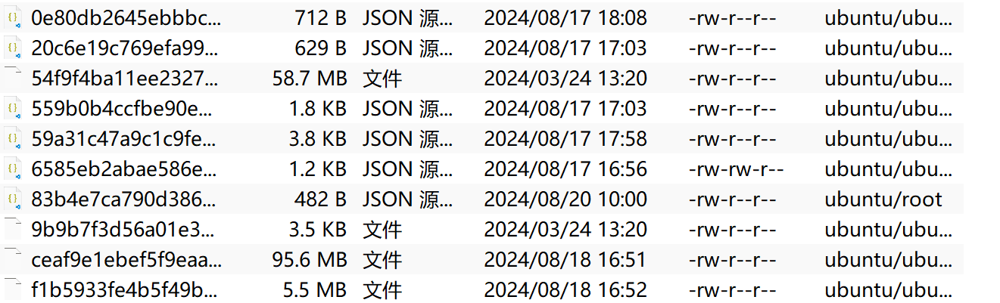

参考`manifest.json`

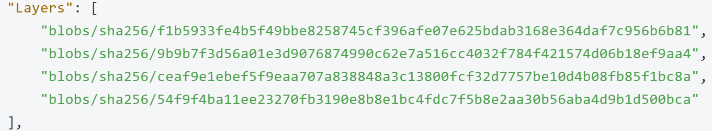

不难发现，以`LayerId`命名的文件体积明显大于其他文件。究其根本，仅`LayerId`命名的文件为层文件，包含了对应层的信息，格式为压缩文件。而其余文件为元数据文件。此处仅展示`配置信息文件`与`镜像清单文件`。

腾讯云_59a31c47a9c1c9fec78b40bab702a416ac117faa16f22bddfaa5b09d65ac638e.json

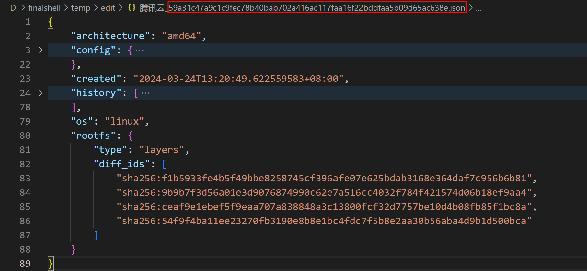

腾讯云_6585eb2abae586e65263d7ff269cab4d76fedf2181688f68615fd43e43070633.json

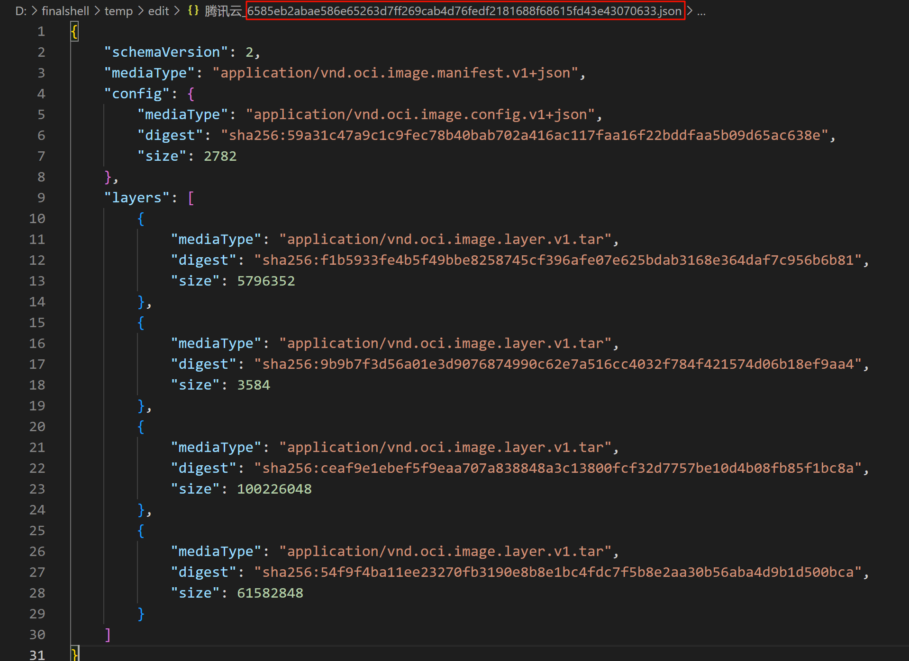

对于四个以`LayerId`命名的层文件，同样可以使用`tar -xvf`进行解压。解压后生成文件如下图。

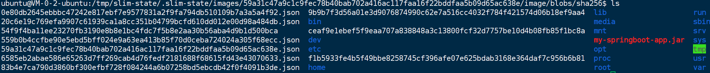

其文件结构恰好对应于日常使用`docker`时使用`docker exec`进入容器内部所观察到的`“小虚拟机”`结构。

而最初`Dockerfile`中复制的`my-springboot-app.jar`也被解压而出现。

## 5.console output


```Shell
cmd=xray state=started
cmd=xray info=params target='59a31c47a9c1' add-image-manifest='false' add-image-config='false' rm-file-artifacts='false' 
cmd=xray state=image.api.inspection.start
cmd=xray info=image id='sha256:59a31c47a9c1c9fec78b40bab702a416ac117faa16f22bddfaa5b09d65ac638e' size.bytes='166399782' size.human='166 MB' architecture='amd64' 
//image history存储到镜像栈image_stack中
cmd=xray info=image.stack index='0' name='registry.cn-beijing.aliyuncs.com/the_first_ikun/spring:app' id='sha256:59a31c47a9c1c9fec78b40bab702a416ac117faa16f22bddfaa5b09d65ac638e' instructions='11' message='see report file for details' 
//镜像inspection，创建状态目录
cmd=xray state=image.api.inspection.done
cmd=xray state=image.data.inspection.start
cmd=xray info=image.data.inspection.save.image.start
//保存Docker镜像到本地文件系统，并可选地解压缩并删除原文件(默认不会)。
cmd=xray info=image.data.inspection.save.image.end
cmd=xray info=image.data.inspection.process.image.start
//从 Docker 镜像的压缩包中加载镜像信息，并解析成一个 Package 结构体
cmd=xray info=image.data.inspection.process.image.end
cmd=xray state=image.data.inspection.done
//开始打印Package 结构体信息
cmd=xray info=image.package.details
cmd=xray info=layers.count value='4' 
//对应slim.report.json.iamge_report.identities, 详细列出了层文件内的身份信息
cmd=xray info=image.identities.stats user_count='28' group_count='48' 
cmd=xray info=image.identities.user username='man' uid='13' home='/usr/man' shell='/sbin/nologin' no_login_shell='true' no_password_login='true' 
cmd=xray info=image.identities.user username='ftp' uid='21' home='/var/lib/ftp' shell='/sbin/nologin' no_login_shell='true' no_password_login='true' 
cmd=xray info=image.identities.user no_login_shell='true' no_password_login='true' username='games' uid='35' home='/usr/games' shell='/sbin/nologin' 
cmd=xray info=image.identities.user username='guest' uid='405' home='/dev/null' shell='/sbin/nologin' no_login_shell='true' no_password_login='true' 
cmd=xray info=image.identities.user no_login_shell='true' no_password_login='true' username='vpopmail' uid='89' home='/var/vpopmail' shell='/sbin/nologin' 
cmd=xray info=image.identities.user home='/root' shell='/bin/ash' no_login_shell='false' no_password_login='true' username='root' uid='0' 
cmd=xray info=image.identities.user username='mail' uid='8' home='/var/spool/mail' shell='/sbin/nologin' no_login_shell='true' no_password_login='true' 
cmd=xray info=image.identities.user shell='/sbin/nologin' no_login_shell='true' no_password_login='true' username='at' uid='25' home='/var/spool/cron/atjobs' 
cmd=xray info=image.identities.user username='cyrus' uid='85' home='/usr/cyrus' shell='/sbin/nologin' no_login_shell='true' no_password_login='true' 
cmd=xray info=image.identities.user username='adm' uid='3' home='/var/adm' shell='/sbin/nologin' no_login_shell='true' no_password_login='true' 
cmd=xray info=image.identities.user username='operator' uid='11' home='/root' shell='/bin/sh' no_login_shell='false' no_password_login='true' 
cmd=xray info=image.identities.user username='squid' uid='31' home='/var/cache/squid' shell='/sbin/nologin' no_login_shell='true' no_password_login='true' 
cmd=xray info=image.identities.user username='smmsp' uid='209' home='/var/spool/mqueue' shell='/sbin/nologin' no_login_shell='true' no_password_login='true' 
cmd=xray info=image.identities.user username='postgres' uid='70' home='/var/lib/postgresql' shell='/bin/sh' no_login_shell='false' no_password_login='true' 
cmd=xray info=image.identities.user username='sync' uid='5' home='/sbin' shell='/bin/sync' no_login_shell='false' no_password_login='true' 
cmd=xray info=image.identities.user username='news' uid='9' home='/usr/lib/news' shell='/sbin/nologin' no_login_shell='true' no_password_login='true' 
cmd=xray info=image.identities.user uid='14' home='/var/spool/mail' shell='/sbin/nologin' no_login_shell='true' no_password_login='true' username='postmaster' 
cmd=xray info=image.identities.user username='sshd' uid='22' home='/dev/null' shell='/sbin/nologin' no_login_shell='true' no_password_login='true' 
cmd=xray info=image.identities.user shell='/sbin/nologin' no_login_shell='true' no_password_login='true' username='daemon' uid='2' home='/sbin' 
cmd=xray info=image.identities.user username='halt' uid='7' home='/sbin' shell='/sbin/halt' no_login_shell='false' no_password_login='true' 
cmd=xray info=image.identities.user username='xfs' uid='33' home='/etc/X11/fs' shell='/sbin/nologin' no_login_shell='true' no_password_login='true' 
cmd=xray info=image.identities.user username='bin' uid='1' home='/bin' shell='/sbin/nologin' no_login_shell='true' no_password_login='true' 
cmd=xray info=image.identities.user no_password_login='true' username='lp' uid='4' home='/var/spool/lpd' shell='/sbin/nologin' no_login_shell='true' 
cmd=xray info=image.identities.user home='/sbin' shell='/sbin/shutdown' no_login_shell='false' no_password_login='true' username='shutdown' uid='6' 
cmd=xray info=image.identities.user username='uucp' uid='10' home='/var/spool/uucppublic' shell='/sbin/nologin' no_login_shell='true' no_password_login='true' 
cmd=xray info=image.identities.user username='ntp' uid='123' home='/var/empty' shell='/sbin/nologin' no_login_shell='true' no_password_login='true' 
cmd=xray info=image.identities.user home='/var/spool/cron' shell='/sbin/nologin' no_login_shell='true' no_password_login='true' username='cron' uid='16' 
cmd=xray info=image.identities.user username='nobody' uid='65534' home='/' shell='/sbin/nologin' no_login_shell='true' no_password_login='true' 
//重复文件检测
cmd=xray info=image.stats.duplicates file_size.bytes='797334' file_size.human='797 kB' file_total_size.bytes='1596311' file_total_size.human='1.6 MB' wasted.bytes='798977' wasted.human='799 kB' file_count='36' file_total_count='101' 
cmd=xray info=layer.start
//详细列出每个layer信息
cmd=xray info=layer index='0' id='f1b5933fe4b5f49bbe8258745cf396afe07e625bdab3168e364daf7c956b6b81' path='blobs/sha256/f1b5933fe4b5f49bbe8258745cf396afe07e625bdab3168e364daf7c956b6b81' 
cmd=xray info=distro name='Alpine Linux' version='3.9.4' display='Alpine Linux v3.9' 
cmd=xray info=change.instruction snippet='ADD file:a86aea1f3a7d68f6ae03397b99ea77f2e9e...' all='ADD file:a86aea1f3a7d68f6ae03397b99ea77f2e9ee901c5c59e59f76f93adbb4035913 /' index='0:0' type='ADD' 
//同个layID的其他指令，使用了缓存层
cmd=xray info=other.instructions count='2' 
cmd=xray info=other.instruction snippet='CMD ["/bin/sh"] all='CMD ["/bin/sh"] pos='0' index='0:1' type='CMD' 
cmd=xray info=other.instruction pos='1' index='0:2' type='ENV' snippet='ENV LANG=C.UTF-8' all='ENV LANG=C.UTF-8' 
//layer元数据
cmd=xray info=layer.stats all_size.bytes='5528857' all_size.human='5.5 MB' 
cmd=xray info=layer.stats object_count='482' 
cmd=xray info=layer.stats dir_count='88' 
cmd=xray info=layer.stats file_count='70' 
cmd=xray info=layer.stats link_count='324' 
cmd=xray info=layer.stats max_file_size.bytes='2597536' max_file_size.human='2.6 MB' 
cmd=xray info=layer.stats added_size.human='5.5 MB' added_size.bytes='5528857' 
cmd=xray info=layer.change.summary deleted='0' modified='0' added='482' all='482' 
cmd=xray info=layer.objects.count value='482' 

cmd=xray info=layer.objects.top.start
//该layer中每个object（文件）的信息
cmd=xray info=object mode='-rwxr-xr-x' size.human='2.6 MB' gid='0' H='H=[A:0]' object.name='/lib/libcrypto.so.1.1' size.bytes='2597536' uid='0' mtime='2019-03-15T14:28:19Z' hash=' hash=a8430ee16f87efe1561de7290aab3a8eeb1b3b6e' 
cmd=xray info=object gid='0' mtime='2019-01-24T07:45:56Z' object.name='/bin/busybox' mode='-rwxr-xr-x' size.human='796 kB' size.bytes='796240' uid='0' H='H=[A:0]' hash=' hash=7448dd02af2b09251816b41e5254afcdd1edcad6' 
cmd=xray info=object gid='0' mtime='2019-03-19T09:56:55Z' H='H=[A:0]' mode='-rwxr-xr-x' size.human='584 kB' size.bytes='584304' uid='0' hash=' hash=fd33c5379571e01442cd4d8ef44ce7f98de049d5' object.name='/lib/ld-musl-x86_64.so.1' 
cmd=xray info=object mtime='2019-03-15T14:28:19Z' hash=' hash=799b9fb85877a777408cc8b9458ccb3018355f3b' object.name='/lib/libssl.so.1.1' size.human='520 kB' gid='0' uid='0' H='H=[A:0]' mode='-rwxr-xr-x' size.bytes='519632' 
cmd=xray info=object hash=' hash=ee65b588599417b6ac6002ff094f01c0142f80f4' object.name='/etc/ssl/cert.pem' mode='-rw-r--r--' size.human='233 kB' uid='0' gid='0' mtime='2019-01-29T16:27:19Z' size.bytes='232598' H='H=[A:0]' 
cmd=xray info=object uid='0' mtime='2019-01-10T09:28:14Z' H='H=[A:0]' hash=' hash=ada8e5b398684ed7b22bf72b62eb6490877853e9' object.name='/sbin/apk' mode='-rwxr-xr-x' size.human='211 kB' size.bytes='211304' gid='0' 
cmd=xray info=object size.human='100 kB' uid='0' gid='0' object.name='/lib/libz.so.1.2.11' mode='-rwxr-xr-x' size.bytes='100144' mtime='2018-11-15T16:42:03Z' H='H=[A:0]' hash=' hash=2a83d998a8b50c763144e6793a16c297eb05f405' 
cmd=xray info=object mode='-rwxr-xr-x' size.human='96 kB' gid='0' size.bytes='96096' uid='0' mtime='2019-01-06T14:23:43Z' H='H=[A:0]' hash=' hash=a094de2b0f7b77a0beb4d14ad6965a4d92709619' object.name='/usr/lib/libtls-standalone.so.1.0.0' 
cmd=xray info=object H='H=[A:0]' hash=' hash=82b0ee78eb356f353324210af484cd71e437f5bf' object.name='/usr/bin/scanelf' size.human='84 kB' size.bytes='83744' uid='0' mtime='2018-11-15T18:00:32Z' mode='-rwxr-xr-x' gid='0' 
cmd=xray info=object object.name='/usr/bin/getent' size.human='52 kB' size.bytes='51912' uid='0' gid='0' mtime='2019-03-19T09:56:55Z' mode='-rwxr-xr-x' H='H=[A:0]' hash=' hash=339c27944283131c8520d1bf2087e72e3f2864fd' 
cmd=xray info=object object.name='/usr/bin/getconf' mode='-rwxr-xr-x' size.human='37 kB' gid='0' H='H=[A:0]' size.bytes='36728' uid='0' mtime='2019-03-19T09:56:55Z' hash=' hash=78393df1b72be819340315bead1226ed81c0206d' 
cmd=xray info=object mode='-rw-r--r--' gid='0' mtime='2019-01-23T20:46:29Z' H='H=[A:0]' hash=' hash=3417b4aeb0bc1ccccd9957f8c9b48435cb1d7b2d' size.human='36 kB' size.bytes='36141' uid='0' object.name='/etc/services' 
cmd=xray info=object size.bytes='25216' H='H=[A:0]' object.name='/usr/bin/iconv' hash=' hash=0cd93d73528ffbcae4ad9a2aa13632ec88efca7a' mode='-rwxr-xr-x' size.human='25 kB' uid='0' gid='0' mtime='2019-03-19T09:56:55Z' 
cmd=xray info=object mode='-rwxr-xr-x' size.bytes='22768' mtime='2019-03-15T14:28:19Z' object.name='/usr/lib/engines-1.1/afalg.so' size.human='23 kB' uid='0' gid='0' H='H=[A:0]' hash=' hash=29fa1f27c26c66f15c63b40603585b517a8dec0a' 
cmd=xray info=object object.name='/usr/bin/ssl_client' uid='0' mtime='2019-01-24T07:45:56Z' H='H=[A:0]' gid='0' hash=' hash=cf41503fb9b9badf4e31587b411f5d9d5cdeed1c' mode='-rwxr-xr-x' size.human='14 kB' size.bytes='13968' 
cmd=xray info=object hash=' hash=2ad5d792e81a8feaf06a7ddc0dc8118e1e965250' object.name='/sbin/mkmntdirs' mode='-rwxr-xr-x' size.human='14 kB' size.bytes='13968' uid='0' gid='0' mtime='2019-01-23T20:46:29Z' H='H=[A:0]' 
cmd=xray info=object size.bytes='13864' gid='0' mtime='2019-03-15T14:28:19Z' H='H=[A:0]' hash=' hash=5e55413e7898a589a6cf79d24546f18237ba3854' object.name='/usr/lib/engines-1.1/padlock.so' mode='-rwxr-xr-x' size.human='14 kB' uid='0' 
cmd=xray info=object mode='-rwxr-xr-x' uid='0' mtime='2019-03-15T14:28:19Z' H='H=[A:0]' object.name='/usr/lib/engines-1.1/capi.so' size.human='14 kB' size.bytes='13856' gid='0' hash=' hash=8e87db457c1b56c01c8836fc05d7a65cef80f440' 
cmd=xray info=object object.name='/lib/apk/db/installed' mode='-rw-r--r--' size.human='11 kB' uid='0' mtime='2019-05-09T20:49:41Z' hash=' hash=65c26cbb418d82c8d3d89980944feb8ff110c272' size.bytes='11308' gid='0' H='H=[A:0/M:2]' 
cmd=xray info=object size.bytes='10909' uid='0' gid='0' object.name='/etc/ssl/openssl.cnf.dist' size.human='11 kB' mtime='2019-03-15T14:27:26Z' H='H=[A:0]' hash=' hash=c06bb154438af6218b8f58bc0f70520674fb3090' mode='-rw-r--r--' 
cmd=xray info=layer.objects.top.end

cmd=xray info=layer.end
cmd=xray info=layer.start

//同上,第二层
cmd=xray info=layer index='1' id='9b9b7f3d56a01e3d9076874990c62e7a516cc4032f784f421574d06b18ef9aa4' path='blobs/sha256/9b9b7f3d56a01e3d9076874990c62e7a516cc4032f784f421574d06b18ef9aa4' 
cmd=xray info=change.instruction index='0:3' type='RUN' snippet='RUN {          echo '#!/bin/sh';               echo 'set -e';  ...' all='RUN {                 echo '#!/bin/sh';             echo 'set -e';          echo;           echo 'dirname "$(dirname "$(readlink -f "$(which javac || which java)")")"';    } > /usr/local/bin/docker-java-home && \
        chmod +x /usr/local/bin/docker-java-home' 
cmd=xray info=other.instructions count='4' 
cmd=xray info=other.instruction all='ENV JAVA_HOME=/usr/lib/jvm/java-1.8-openjdk' pos='0' index='0:4' type='ENV' snippet='ENV JAVA_HOME=/usr/lib/jvm/java-1.8-openjdk' 
cmd=xray info=other.instruction index='0:5' type='ENV' snippet='ENV PATH=/usr/local/sbin:/usr/local/bin:/usr...' all='ENV PATH=/usr/local/sbin:/usr/local/bin:/usr/sbin:/usr/bin:/sbin:/bin:/usr/lib/jvm/java-1.8-openjdk/jre/bin:/usr/lib/jvm/java-1.8-openjdk/bin' pos='1' 
cmd=xray info=other.instruction pos='2' index='0:6' type='ENV' snippet='ENV JAVA_VERSION=8u212' all='ENV JAVA_VERSION=8u212' 
cmd=xray info=other.instruction all='ENV JAVA_ALPINE_VERSION=8.212.04-r0' pos='3' index='0:7' type='ENV' snippet='ENV JAVA_ALPINE_VERSION=8.212.04-r0' 
cmd=xray info=layer.stats all_size.human='87 B' all_size.bytes='87' 
cmd=xray info=layer.stats object_count='4' 
cmd=xray info=layer.stats dir_count='3' 
cmd=xray info=layer.stats file_count='1' 
cmd=xray info=layer.stats max_file_size.human='87 B' max_file_size.bytes='87' 
cmd=xray info=layer.stats added_size.human='87 B' added_size.bytes='87' 
cmd=xray info=layer.change.summary deleted='0' modified='3' added='1' all='4' 
cmd=xray info=layer.objects.count value='4' 
cmd=xray info=layer.objects.top.start
cmd=xray info=object object.name='/usr/local/bin/docker-java-home' size.human='87 B' size.bytes='87' uid='0' mtime='2019-05-11T01:32:11Z' H='H=[A:1]' hash=' hash=76f5ef5e1cc1a27760d486e5dccbbbb6673194c0' mode='-rwxr-xr-x' gid='0' 
cmd=xray info=object mode='drwxr-xr-x' size.human='0 B' uid='0' mtime='2019-05-11T01:32:11Z' H='H=[A:0/M:1]' hash='' size.bytes='0' gid='0' object.name='/usr/local/bin' 
cmd=xray info=object object.name='/usr/local' size.bytes='0' gid='0' uid='0' mtime='2019-05-09T20:49:40Z' H='H=[A:0/M:1,2]' hash='' mode='drwxr-xr-x' size.human='0 B' 
cmd=xray info=object object.name='/usr' mode='drwxr-xr-x' size.human='0 B' size.bytes='0' gid='0' mtime='2019-05-09T20:49:40Z' H='H=[A:0/M:1,2]' hash='' uid='0' 
cmd=xray info=layer.objects.top.end
cmd=xray info=layer.end
cmd=xray info=layer.start

//同上，第三层
cmd=xray info=layer index='2' id='ceaf9e1ebef5f9eaa707a838848a3c13800fcf32d7757be10d4b08fb85f1bc8a' path='blobs/sha256/ceaf9e1ebef5f9eaa707a838848a3c13800fcf32d7757be10d4b08fb85f1bc8a' 
cmd=xray info=change.instruction snippet='RUN set -x && \
        apk add --no-cache              openjd...' all='RUN set -x && \
        apk add --no-cache              openjdk8="$JAVA_ALPINE_VERSION" && \
        [ "$JAVA_HOME" = "$(docker-java-home)" ]' index='0:8' type='RUN' 
cmd=xray info=layer.stats all_size.human='99 MB' all_size.bytes='99267953' 
cmd=xray info=layer.stats object_count='1435' 
cmd=xray info=layer.stats dir_count='192' 
cmd=xray info=layer.stats file_count='864' 
cmd=xray info=layer.stats link_count='379' 
cmd=xray info=layer.stats max_file_size.human='35 MB' max_file_size.bytes='34755302' 
cmd=xray info=layer.stats added_size.human='99 MB' added_size.bytes='99164859' 
cmd=xray info=layer.stats modified_size.human='103 kB' modified_size.bytes='103094' 
cmd=xray info=layer.change.summary modified='23' added='1412' all='1435' deleted='0' 
cmd=xray info=layer.objects.count value='1435' 
cmd=xray info=layer.objects.top.start
cmd=xray info=object mtime='2019-05-04T18:03:30Z' H='H=[A:2]' object.name='/usr/lib/jvm/java-1.8-openjdk/jre/lib/rt.jar' size.human='35 MB' uid='0' gid='0' mode='-rw-r--r--' size.bytes='34755302' hash=' hash=8bfb18575ade5c7352c449326354426a97e99eff' 
cmd=xray info=object size.human='9.8 MB' size.bytes='9780201' H='H=[A:2]' hash=' hash=acd814eee362855c92cc832b5f8cc4b29c6b0970' mode='-rw-r--r--' uid='0' gid='0' mtime='2019-05-04T18:03:30Z' object.name='/usr/lib/jvm/java-1.8-openjdk/lib/ct.sym' 
cmd=xray info=object mode='-rwxr-xr-x' size.bytes='8930992' uid='0' gid='0' mtime='2019-05-04T18:05:26Z' H='H=[A:2]' size.human='8.9 MB' hash=' hash=e96fe3afd9a8053100c21331297d3219b9572bd1' object.name='/usr/lib/jvm/java-1.8-openjdk/jre/lib/amd64/server/libjvm.so' 
cmd=xray info=object H='H=[A:2]' object.name='/usr/lib/jvm/java-1.8-openjdk/lib/tools.jar' size.bytes='8620195' mtime='2019-05-04T18:03:30Z' uid='0' gid='0' hash=' hash=4e7ab2a550a6f1e64f4ad8dda27b666dcfe1e1b6' mode='-rw-r--r--' size.human='8.6 MB' 
cmd=xray info=object gid='0' H='H=[A:2]' mode='-rw-r--r--' size.bytes='4004250' uid='0' object.name='/usr/lib/jvm/java-1.8-openjdk/jre/lib/ext/cldrdata.jar' size.human='4.0 MB' mtime='2019-05-04T18:03:30Z' hash=' hash=65ef04845378cbb6bbd9eaa931292740726be866' 
cmd=xray info=object mode='-rw-r--r--' size.human='2.0 MB' uid='0' gid='0' mtime='2019-05-04T18:03:30Z' H='H=[A:2]' size.bytes='2033509' hash=' hash=fbe08ca5288808c2d51b7b21dfa83033d530e49b' object.name='/usr/lib/jvm/java-1.8-openjdk/jre/lib/ext/nashorn.jar' 
cmd=xray info=object size.bytes='1880896' gid='0' mtime='2019-05-04T18:03:30Z' hash=' hash=01bd4339bc27a8b7adaee968edfc646b925b2e0a' object.name='/usr/lib/jvm/java-1.8-openjdk/jre/lib/charsets.jar' mode='-rw-r--r--' size.human='1.9 MB' uid='0' H='H=[A:2]' 
cmd=xray info=object object.name='/usr/lib/libstdc++.so.6.0.25' H='H=[A:2]' hash=' hash=8f1e1103e16fef6cfa07932bbf10371a2e783ecf' mode='-rwxr-xr-x' size.human='1.4 MB' size.bytes='1378688' uid='0' gid='0' mtime='2019-04-08T17:44:57Z' 
cmd=xray info=object size.human='1.2 MB' hash=' hash=9ddec5b0cb8efb7d35f556d9161fe5c06e8a72cd' object.name='/usr/lib/libnss3.so.41' mode='-rwxr-xr-x' size.bytes='1225552' uid='0' gid='0' mtime='2018-12-20T12:11:51Z' H='H=[A:2]' 
cmd=xray info=object H='H=[A:2]' size.human='1.2 MB' uid='0' mtime='2019-05-04T18:03:30Z' hash=' hash=2ddb20ac95c78b9b99b7ed1f3761bfb740c37d8f' object.name='/usr/lib/jvm/java-1.8-openjdk/jre/lib/ext/localedata.jar' mode='-rw-r--r--' size.bytes='1204589' gid='0' 
cmd=xray info=object gid='0' mtime='2018-11-21T17:52:07Z' hash=' hash=8b72d2efedc23d2eb9696effd1e35b18f2286782' mode='-rwxr-xr-x' size.bytes='1185832' uid='0' H='H=[A:2]' object.name='/usr/lib/libX11.so.6.3.0' size.human='1.2 MB' 
cmd=xray info=object gid='0' H='H=[A:2]' mode='-rw-r--r--' size.human='1.1 MB' size.bytes='1133787' uid='0' mtime='2019-05-04T18:03:30Z' hash=' hash=058b0b5d2fa4d1c6e861077f9b505d18784c54dd' object.name='/usr/lib/jvm/java-1.8-openjdk/jre/lib/resources.jar' 
cmd=xray info=object uid='0' gid='0' mtime='2018-12-14T12:51:39Z' hash=' hash=6d3c597e8b45814562fd73745d9db739abc67c03' object.name='/usr/lib/libp11-kit.so.0.3.0' mode='-rwxr-xr-x' size.bytes='1121744' size.human='1.1 MB' H='H=[A:2]' 
cmd=xray info=object H='H=[A:2]' hash=' hash=eea1a05fc7b216db2266c78cafce557e73fdec49' size.human='1.0 MB' size.bytes='1030104' gid='0' mtime='2019-05-04T18:05:23Z' object.name='/usr/lib/jvm/java-1.8-openjdk/jre/lib/amd64/libmlib_image.so' mode='-rwxr-xr-x' uid='0' 
cmd=xray info=object gid='0' hash=' hash=6495cf2f5bbcbc671b16d08d46e6ee6648cae240' mode='-rwxr-xr-x' size.human='944 kB' size.bytes='944256' uid='0' mtime='2019-01-10T09:33:21Z' H='H=[A:2]' object.name='/usr/lib/libasound.so.2.0.0' 
cmd=xray info=object size.human='901 kB' gid='0' mtime='2018-12-31T11:22:33Z' object.name='/usr/lib/libsqlite3.so.0.8.6' mode='-rwxr-xr-x' size.bytes='900896' uid='0' H='H=[A:2]' hash=' hash=04e1a89f1041d927716ca10dbc9365f627e49da1' 
cmd=xray info=object mtime='2019-01-21T18:14:18Z' H='H=[A:2]' size.bytes='809416' uid='0' gid='0' hash=' hash=68d59102ef3cd7c294c8e64a807deb3bead6e347' object.name='/usr/lib/libkrb5.so.3.3' mode='-rw-r--r--' size.human='809 kB' 
cmd=xray info=object size.human='721 kB' uid='0' hash=' hash=868b86feaf6ca05840121107017ac985cc04e7d7' object.name='/usr/lib/jvm/java-1.8-openjdk/jre/lib/amd64/libawt.so' mode='-rwxr-xr-x' size.bytes='720600' gid='0' mtime='2019-05-04T18:05:26Z' H='H=[A:2]' 
cmd=xray info=object mode='-rwxr-xr-x' size.human='719 kB' H='H=[A:2]' object.name='/usr/lib/libfreetype.so.6.16.1' hash=' hash=e7a1a3ac07f20f80710cc93313b1d10737340bf6' size.bytes='718936' uid='0' gid='0' mtime='2018-11-21T17:40:32Z' 
cmd=xray info=object size.bytes='573398' uid='0' gid='0' object.name='/usr/share/X11/locale/en_US.UTF-8/Compose' hash=' hash=d82131f529c46d8e076063b19046c179c6a09d94' mode='-rw-r--r--' size.human='573 kB' mtime='2018-11-21T17:51:49Z' H='H=[A:2]' 
cmd=xray info=layer.objects.top.end
cmd=xray info=layer.end
cmd=xray info=layer.start

//同上，第四层
cmd=xray info=layer index='3' id='54f9f4ba11ee23270fb3190e8b8e1bc4fdc7f5b8e2aa30b56aba4d9b1d500bca' path='blobs/sha256/54f9f4ba11ee23270fb3190e8b8e1bc4fdc7f5b8e2aa30b56aba4d9b1d500bca' 
cmd=xray info=change.instruction index='0:9' type='COPY' snippet='COPY demo-0.0.1-SNAPSHOT.jar my-springboot-a...' all='COPY demo-0.0.1-SNAPSHOT.jar my-springboot-app.jar' 
cmd=xray info=other.instructions count='1' 
cmd=xray info=other.instruction pos='0' index='0:10' type='CMD' snippet='CMD ["java","-jar","/my-springboot-app.jar"]...' all='CMD ["java","-jar","/my-springboot-app.jar"]
cmd=xray info=layer.stats all_size.human='62 MB' all_size.bytes='61580927' 
cmd=xray info=layer.stats object_count='1' 
cmd=xray info=layer.stats file_count='1' 
cmd=xray info=layer.stats max_file_size.human='62 MB' max_file_size.bytes='61580927' 
cmd=xray info=layer.stats added_size.human='62 MB' added_size.bytes='61580927' 
cmd=xray info=layer.change.summary deleted='0' modified='0' added='1' all='1' 
cmd=xray info=layer.objects.count value='1' 
cmd=xray info=layer.objects.top.start
cmd=xray info=object mtime='2024-03-24T05:20:42Z' object.name='/my-springboot-app.jar' mode='-rw-r--r--' size.human='62 MB' size.bytes='61580927' hash=' hash=2eb1de423b6c33dcf22be03e440690522e445598' uid='0' gid='0' H='H=[A:3]' 
cmd=xray info=layer.objects.top.end
cmd=xray info=layer.end
//镜像内自带的shell
cmd=xray info=image.shells link_path='/bin/busybox' reference='' verified='true' full_name='Ash shell' short_name='ash' exe_path='/bin/ash' 
cmd=xray info=image.shells short_name='sh' exe_path='/bin/sh' link_path='/bin/busybox' reference='' verified='true' full_name='Bourne shell' 
//镜像的cmd+entry
cmd=xray info=image.entry exe_args='-jar,/my-springboot-app.jar' exe_path='java' 
cmd=xray info=image.entry.full_exe_path name='/usr/bin/java' layer='2' 
cmd=xray info=image.entry.arg_file name='/my-springboot-app.jar' layer='3' 
cmd=xray info=image.special_perms.sticky name='/tmp' 
cmd=xray info=image.special_perms.sticky name='/var/tmp' 
cmd=xray state=completed
cmd=xray state=done
//slim产物路径
cmd=xray info=results artifacts.location='/tmp/slim-state/.slim-state/images/59a31c47a9c1c9fec78b40bab702a416ac117faa16f22bddfaa5b09d65ac638e/artifacts' 
cmd=xray info=results artifacts.dockerfile.original='Dockerfile.fat' 
cmd=xray info=report file='slim.report.json' 
```

# 源码解读

1. 初始化：设置日志记录器，编译正则表达式匹配器等。
2. 版本检查：异步检查版本信息。
3. 报告初始化：创建Xray命令报告实例，并设置初始状态。
4. Docker客户端初始化：尝试创建Docker客户端实例，处理错误情况。
5. 镜像检查：
   1. 检查目标镜像是否存在，如果不存在且`doPull`为真，则尝试拉取镜像。
   2. 如果镜像存在，检查并处理镜像元数据。
6. 处理镜像信息：
   1. 提取和显示镜像的ID、大小、架构等信息。
   2. 处理Dockerfile中的用户、暴露端口等信息。
7. 报告填充：将镜像信息填充到报告中。
8. 保存镜像到本地：如果镜像未保存，则保存到本地。
9. 加载并处理镜像包：加载Docker镜像包并解析其内容。
10. 处理镜像包细节：遍历镜像层，处理每个层的变更（添加、修改、删除）。
11. 输出镜像包详情：输出镜像包中的对象、层统计信息、证书等。
12. 清理和结束：清理临时文件（如果配置为删除），输出最终结果，并保存报告。

# 关键函数

- printImagePackage

- LoadPackage

- layerFromStream

- inspectFile

  

# 											Build

# 模块介绍

`build`命令会分析 Docker 镜像，移除不需要的层、文件和依赖项，从而显著减小镜像的大小，提高加载和部署速度，节省存储空间和网络传输时间，加强镜像安全性。

# 核心流程

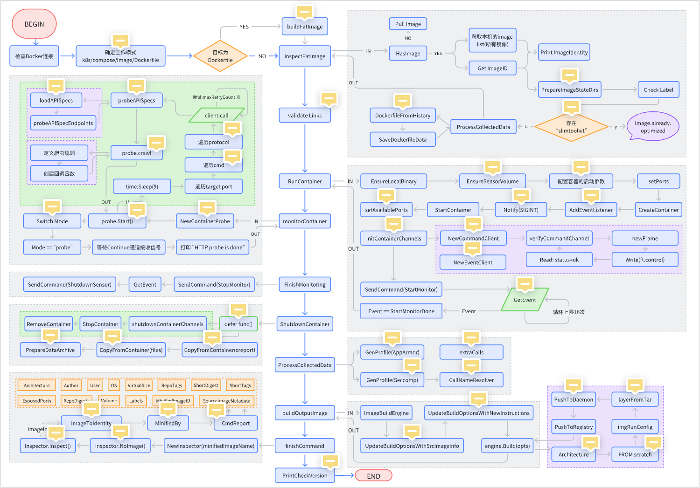

# 快速开始

## 构造测试镜像

1.jar包

[点击获取](https://ikun111.oss-cn-beijing.aliyuncs.com/dockertest-0.0.1-SNAPSHOT.jar)


2.Dockerfile

```Dockerfile
FROM openjdk:8-jdk-alpine

COPY dockertest-0.0.1-SNAPSHOT.jar my-springboot-app.jar

EXPOSE 8081
```

1. 开始构建

```Bash
## 构建镜像名为 test:latest
docker build -t test .
```

3. 运行容器

```Bash
##若imageId不一致，请替换为 registry:tag 即 test:latest
docker run  --name test -itd -p 8081:8081 f32d4adebb6d
```

4. 功能检测

```Bash
curl -X GET localhost:8081/test
curl -X POST localhost:8081/test
##出现如下结果说明测试通过
```

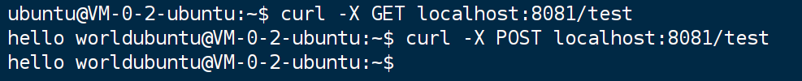

## 模块测试

1. 镜像瘦身

```Bash
slim --log test.log --log-level trace build --target f32d4adebb6d--tag test.slim:latest --http-probe=true  
```

- 产物1 - 瘦身镜像（可重新执行 4 & 5 验证瘦身镜像的功能）

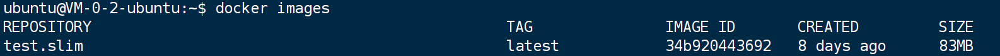

- 产物2 - slim.report.json (当前目录下）

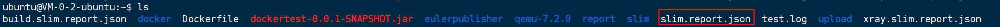

- 产物3 - 日志 test.log (当前目录下）

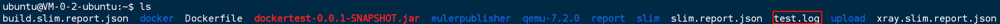

- 产物4 - artifacts

```Bash
cd /tmp/slim-state/.slim-state/images/f32d4adebb6d2f06f3ef6801a5e056d934c397afa93b15157c7ed670c062add9/artifacts
```

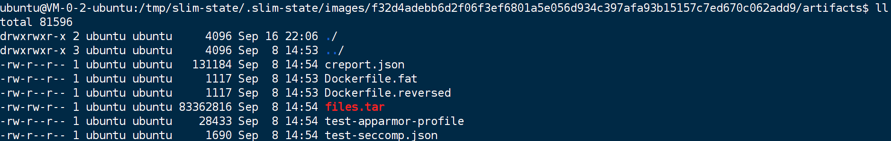

# 模块产物

## 1. console output

```Verilog
cmd=build info=param.http.probe message='using default probe' 
cmd=build state=started
cmd=build info=params rt.as.user='true' keep.perms='true' tags='test.slim:latest' image-build-engine='internal' target.type='image' target.image='f32d4adebb6d' continue.mode='probe' 
//inspectFatImage
cmd=build state=image.inspection.start
cmd=build info=image id='sha256:f32d4adebb6d2f06f3ef6801a5e056d934c397afa93b15157c7ed670c062add9' size.bytes='122382868' size.human='122 MB' 
cmd=build info=image.stack index='0' name='test:latest' id='sha256:f32d4adebb6d2f06f3ef6801a5e056d934c397afa93b15157c7ed670c062add9' 
cmd=build info=image.exposed_ports list='8081/tcp' 
cmd=build state=image.inspection.done
//inspectFatImage done
cmd=build state=container.inspection.start
cmd=build info=container name='slimk_1062744_20240908065340' id='d0de3866438d3b0ba629cc196ac8f603465ecd893868e556e7e954b3022071da' status='created' 
cmd=build info=container status='running' name='slimk_1062744_20240908065340' id='d0de3866438d3b0ba629cc196ac8f603465ecd893868e556e7e954b3022071da' 
cmd=build info=container message='obtained IP address' ip='172.17.0.3' 
//send monitor cmd
cmd=build info=cmd.startmonitor status='sent' 
cmd=build info=event.startmonitor.done status='received' 
//startmonitor.done
cmd=build info=container name='slimk_1062744_20240908065340' id='d0de3866438d3b0ba629cc196ac8f603465ecd893868e556e7e954b3022071da' target.port.list='32782' target.port.info='8081/tcp => 0.0.0.0:32782' message='YOU CAN USE THESE PORTS TO INTERACT WITH THE CONTAINER' 
//newCustomProbe
cmd=build state=http.probe.starting message="WAIT FOR HTTP PROBE TO FINISH" 
cmd=build info=continue.after mode='probe' message='no input required, execution will resume when HTTP probing is completed' 
cmd=build prompt='waiting for the HTTP probe to finish'
cmd=build state=http.probe.running//协程开始探测
cmd=build info=http.probe.ports count='1' targets='32782' 
cmd=build info=http.probe.commands count='1' commands='GET /' 
cmd=build info=http.probe.call time='2024-09-08T06:53:50Z' status='error' method='GET' target='http://127.0.0.1:32782/' attempt='1' error='Get "http://127.0.0.1:32782/": read tcp 127.0.0.1:39138->127.0.0.1:32782: read: connection reset by peer' 
cmd=build info=http.probe.call status='error' method='GET' target='http://127.0.0.1:32782/' attempt='2' error='Get "http://127.0.0.1:32782/": read tcp 127.0.0.1:39152->127.0.0.1:32782: read: connection reset by peer' time='2024-09-08T06:53:58Z' 
cmd=build info=http.probe.call target='http://127.0.0.1:32782/' attempt='3' error='Get "http://127.0.0.1:32782/": read tcp 127.0.0.1:52554->127.0.0.1:32782: read: connection reset by peer' time='2024-09-08T06:54:06Z' status='error' method='GET' 
cmd=build info=http.probe.call time='2024-09-08T06:54:16Z' status='404' method='GET' target='http://127.0.0.1:32782/' attempt='4' error='none' 
cmd=build info=http.probe.summary total='4' failures='3' successful='1' 
cmd=build state=http.probe.done
cmd=build info=http.probe.crawler page='0' url='http://127.0.0.1:32782/' //爬虫探测
cmd=build info=probe.crawler.done addr='http://127.0.0.1:32782/' 
cmd=build info=event message='HTTP probe is done' 
cmd=build state=container.inspection.finishing

cmd=build state=container.inspection.artifact.processing
cmd=build state=container.inspection.done

cmd=build state=building engine=internal message="building optimized image" 
cmd=build state=completed
cmd=build info=results status='MINIFIED' by='1.47X' size.original='122 MB' size.optimized='83 MB' 
cmd=build info=results has.data='true' image-build-engine='internal' image.name='test.slim:latest' image.size='83 MB' image.id='sha256:34b920443692e3893c9a20ebc9b05ff2d44df1da4ea076ee2c16560cd276f6d3' image.digest='sha256:7fdc5e69416706b6d70085592ec22cb8828c5b5495d486871b718943e9a9b3ad' 
cmd=build info=results artifacts.location='/tmp/slim-state/.slim-state/images/f32d4adebb6d2f06f3ef6801a5e056d934c397afa93b15157c7ed670c062add9/artifacts' 
cmd=build info=results artifacts.report='creport.json' 
cmd=build info=results artifacts.dockerfile.reversed='Dockerfile.reversed' 
cmd=build info=results artifacts.seccomp='test-seccomp.json' 
cmd=build info=results artifacts.apparmor='test-apparmor-profile' 
cmd=build state=done
cmd=build info=commands message='use the xray command to learn more about the optimize image' 
cmd=build info=report file='slim.report.json' 
app='slim' message='GitHub Discussions' info='https://github.com/slimtoolkit/slim/discussions'
app='slim' message='Join the CNCF Slack channel to ask questions or to share your feedback' info='https://cloud-native.slack.com/archives/C059QP1RH1S'
app='slim' message='Join the Discord server to ask questions or to share your feedback' info='https://discord.gg/9tDyxYS'
app='slim' message='Join the Gitter channel to ask questions or to share your feedback' info='https://gitter.im/docker-slim/community'
```

## 2. slim.report.json

[点击获取](https://ikun111.oss-cn-beijing.aliyuncs.com/build.slim.report.json)

## 3. log

[点击获取](https://ikun111.oss-cn-beijing.aliyuncs.com/test.log)

## 4. artifacts

### 1. creport.json

[点击获取](https://ikun111.oss-cn-beijing.aliyuncs.com/creport.json)

`creport.json`是 `Slim Sensor` 在容器内部生成的容器报告，提供了容器运行的详细信息，包括：

1. **启动命令：**

- **`start_command`**: 定义了容器启动时执行的命令，包括应用名称和参数。
  - `app_name`: 应用名称，这里是 "java"
  - `app_args`: 应用参数，这里是 "-jar" 和 "/my-springboot-app.jar"，表示使用 Java 运行名为 "my-springboot-app.jar" 的 JAR 文件

2. **Slim Sensor 信息：**

- **`sensor`**: 包含 Slim Sensor 的版本和参数信息
  - `version`: Slim Sensor 的版本信息，包括平台、版本号、Git commit ID 和编译时间
  - `args`: Slim Sensor 启动时使用的参数，包括日志级别和日志格式

3. **系统信息：**

- **`system`**: 包含容器运行的系统信息
  - `type`: 操作系统类型，这里是 "Linux"
  - `release`: 内核版本，这里是 "5.15.0-113-generic"
  - `distro`: Linux 发行版信息
    - `name`: 发行版名称，这里是 "Alpine Linux"
    - `version`: 发行版版本，这里是 "3.9.4"
    - `display_name`: 发行版显示名称，这里是 "Alpine Linux v3.9"

4. **监控器信息：**

- **`monitors`**: 包含不同的监控器信息，这里只展示了 "fan" 和 "pt" 两个监控器
  - **`fan`**: 文件系统监控器，记录了容器内所有进程访问的文件信息
    - `monitor_pid`: 监控器进程 ID
    - `monitor_ppid`: 监控器父进程 ID
    - `event_count`: 监控器记录的事件总数
    - `main_process`: 主要进程信息
      - `pid`: 进程 ID
      - `name`: 进程名称
      - `path`: 进程可执行文件路径
      - `cmd`: 进程启动命令
      - `cwd`: 进程当前工作目录
      - `root`: 进程根目录
      - `ppid`: 进程父进程 ID
    - `processes`: 容器内所有进程的信息，这里只展示了进程 ID 为 15 的进程信息
    - `process_files`: 每个进程访问的文件信息，包括文件路径、事件计数、首次事件 ID、读写次数等
  - **`pt`**: 系统调用追踪监控器，记录了容器内所有进程发起的系统调用信息
    - `enabled`: 监控器是否启用
    - `arch_name`: 容器运行的 CPU 架构
    - `syscall_count`: 监控器记录的系统调用总数
    - `syscall_num`: 监控器记录的不同系统调用数量
    - `syscall_stats`: 每个系统调用信息，包括系统调用编号、名称、调用次数等。
    - `fs_activity`: 文件系统活动信息，记录了每个文件被访问的次数、访问类型、发起访问的进程 ID 等

5. **镜像文件信息：**

- **`files`** **数组:** 包含有关单个文件和符号链接的信息
  - `file_type`**:** 指示条目是普通文件 (`file`) 还是符号链接 (`symlink`)
  - `file_path`**:** 系统镜像中文件或符号链接的完整路径
  - `mode`**:** 以标准 Unix 格式表示文件权限（`-rw-r--r--` 表示普通文件，所有者具有读写权限，其他人只有读权限）
  - `flags`**:** 与文件关联的附加标志，例如 `R` 表示文件是只读的。(仅对普通文件提供)
  - `file_size`**:** 文件或符号链接的大小（以字节为单位）
  - `sha1_hash`**:** 文件内容的 SHA1 哈希值。(仅对普通文件提供)

### 2.Dockerfile

生成原理可参考`Xray`部分

```Dockerfile
FROM scratch
# new image

# instruction set group 1

ADD file:a86aea1f3a7d68f6ae03397b99ea77f2e9ee901c5c59e59f76f93adbb4035913 /
CMD ["/bin/sh"]


# instruction set group 2

ENV LANG=C.UTF-8
RUN {                 echo '#!/bin/sh';                 echo 'set -e';                 echo;                 echo 'dirname "$(dirname "$(readlink -f "$(which javac || which java)")")"';         } > /usr/local/bin/docker-java-home && \
        chmod +x /usr/local/bin/docker-java-home
ENV JAVA_HOME=/usr/lib/jvm/java-1.8-openjdk
ENV PATH=/usr/local/sbin:/usr/local/bin:/usr/sbin:/usr/bin:/sbin:/bin:/usr/lib/jvm/java-1.8-openjdk/jre/bin:/usr/lib/jvm/java-1.8-openjdk/bin
ENV JAVA_VERSION=8u212
ENV JAVA_ALPINE_VERSION=8.212.04-r0
RUN set -x && \
        apk add --no-cache                 openjdk8="$JAVA_ALPINE_VERSION" && \
        [ "$JAVA_HOME" = "$(docker-java-home)" ]

# instruction set group 3

# buildkit.dockerfile.v0 (a buildkit instruction)
COPY dockertest-0.0.1-SNAPSHOT.jar my-springboot-app.jar
# buildkit.dockerfile.v0 (a buildkit instruction)
EXPOSE 8081/tcp
# buildkit.dockerfile.v0 (a buildkit instruction)
CMD ["java","-jar","/my-springboot-app.jar"]

# end of image: test:latest (id:  tags: test:latest)
```

### 3.files.tar

`tar -xvf files.tar` 解压后产生文件如下

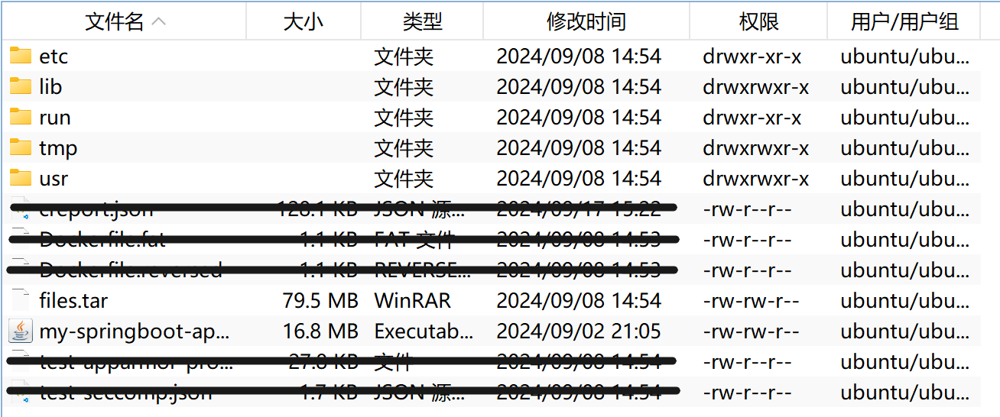

```
files.tar`为`slim`初次运行`FatImage`后导出的文件压缩包，具备容器运行的最小环境，而`files.tar
```

在之后作为`slim image`的第一个`layer`被添加。

另一方面，作为验证，我们可以对`slim image`即`test.slim:latest`进行`slim xray 34b920443692`

等待分析完成，进入制品目录 

```Bash
cd /tmp/slim-state/.slim-state/images/34b920443692e3893c9a20ebc9b05ff2d44df1da4ea076ee2c16560cd276f6d3/image/blobs/sha256
```

将`Layer`tar包解压后，得到如下文件，进一步说明`files.tar`即为了`slim Image`的内容

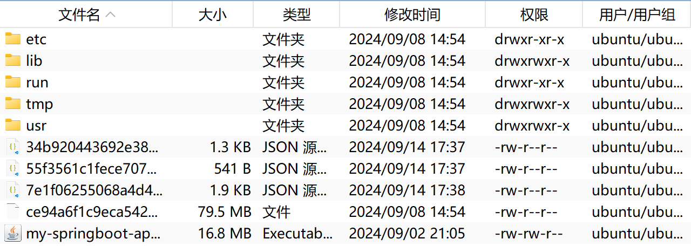

### 4.seccomp

[点击获取](https://ikun111.oss-cn-beijing.aliyuncs.com/test-seccomp.json)

`Seccomp`是一个 `Linux`安全机制，允许开发者限制进程可以访问的系统调用，从而增强应用程序的安全性。`test-seccomp.json`定义了一个 `Seccomp `规则集，允许列出的系统调用，而其他系统调用则被禁止。这个规则集可以用于限制进程可以执行的操作。

**文件内容：**

- **`defaultAction`**: 定义了默认的系统调用处理方式，这里是 `SCMP_ACT_ERRNO`即如果一个系统调用没有被明确允许，它将被拒绝，并返回一个错误码。
- **`architectures`**: 定义了该规则集适用的架构，这里是 `SCMP_ARCH_X86_64`，表示适用于 64 位 x86 架构。
- **`syscalls`**: 定义了具体的系统调用规则。这是一个数组，每个元素都描述一个系统调用规则。

**`syscalls`** **数组中的每个元素包含以下字段：**

- **`names`**: 一个字符串数组，包含了该规则所允许的系统调用名称。例如，`["lstat", "uname", "sysinfo", ...]` 表示允许 `lstat`、`uname`、`sysinfo` 等系统调用。
- **`action`**: 定义了对该系统调用的处理方式，这里是 `SCMP_ACT_ALLOW`，表示允许该系统调用。
- **`includes`**: 一个字典，用于定义该规则所允许的系统调用参数。这个字段在这里为空，表示允许所有参数。
- **`excludes`**: 一个字典，用于定义该规则所禁止的系统调用参数。这个字段在这里为空，表示不禁止任何参数。

### 5. apparmor

[点击获取](https://ikun111.oss-cn-beijing.aliyuncs.com/test-apparmor-profile)

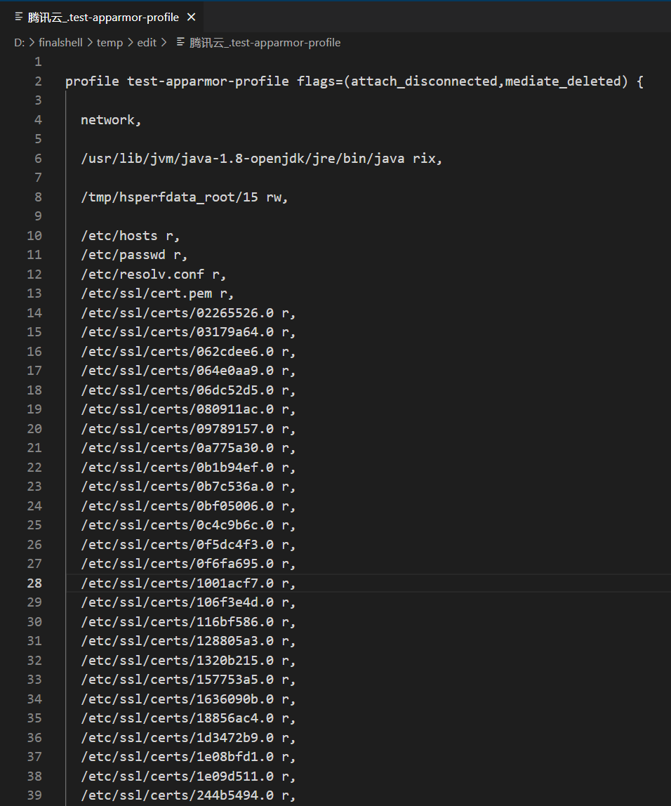

`test-apparmor-profile`是一个 `AppArmor`配置文件，，用于限制名为 "`java`" 的程序的访问权限。

**配置文件内容：**

- **`profile test-apparmor-profile flags=(attach_disconnected,mediate_deleted) {`**：定义了一个名为 `"test-apparmor-profile"`的配置文件。
  - `flags=(attach_disconnected,mediate_deleted)` 表示该配置文件具有两个特殊标志：
  - `attach_disconnected`：允许配置文件应用于未连接的进程。
  - `mediate_deleted`：允许配置文件在文件被删除后继续生效。
- **`network,`**：允许程序访问网络。
- **`/usr/lib/jvm/java-1.8-openjdk/jre/bin/java rix,`**：允许程序执行 `/usr/lib/jvm/java-1.8-openjdk/jre/bin/java` 文件，并允许程序读取、写入和执行该文件。
- **`/tmp/hsperfdata_root/15 rw,`**：允许程序读取和写入 `/tmp/hsperfdata_root/15` 目录。
- **`/etc/hosts r,`**：允许程序读取 `/etc/hosts` 文件。
- **`/etc/passwd r,`**：允许程序读取 `/etc/passwd` 文件。
- **`/etc/resolv.conf r,`**：允许程序读取 `/etc/resolv.conf` 文件。
- **`/etc/ssl/cert.pem r,`**：允许程序读取 `/etc/ssl/cert.pem` 文件。
- **`/etc/ssl/certs/02265526.0 r,`**：允许程序读取 `/etc/ssl/certs/02265526.0` 文件。
- **`/etc/ssl/certs/03179a64.0 r,`**：允许程序读取 `/etc/ssl/certs/03179a64.0` 文件。
- **...**：类似地，配置文件允许程序读取许多其他证书文件。

**总结：**

该配置文件允许名为 "java" 的程序(即jar包)访问网络，执行自身文件，读取和写入 `/tmp/hsperfdata_root/15` 目录，以及读取一些系统配置文件和证书文件。它限制了程序对其他文件的访问权限。

# 关键函数

## 关键数据结构

```Go
// Image defines the interface for interacting with an OCI v1 image.
type Image interface {
    // Layers returns the ordered collection of filesystem layers that comprise this image.//构成此镜像的文件系统层的有序集合。
    // The order of the list is oldest/base layer first, and most-recent/top layer last.
    Layers() ([]Layer, error)
    // MediaType of this image's manifest.
    MediaType() (types.MediaType, error)
    // Size returns the size of the manifest.
    Size() (int64, error)
    // ConfigName returns the hash of the image's config file, also known as
    // the Image ID.
    ConfigName() (Hash, error)
    // ConfigFile returns this image's config file.
    ConfigFile() (*ConfigFile, error)
    // RawConfigFile returns the serialized bytes of ConfigFile().
    RawConfigFile() ([]byte, error)
    // Digest returns the sha256 of this image's manifest.
    Digest() (Hash, error)
    // Manifest returns this image's Manifest object.
    Manifest() (*Manifest, error)
    // RawManifest returns the serialized bytes of Manifest()
    RawManifest() ([]byte, error)
    // LayerByDigest returns a Layer for interacting with a particular layer of
    // the image, looking it up by "digest" (the compressed hash).
    LayerByDigest(Hash) (Layer, error)
    // LayerByDiffID is an analog to LayerByDigest, looking up by "diff id"
    // (the uncompressed hash).
    LayerByDiffID(Hash) (Layer, error)
}
```

更多内容请参考[EulerPublish slim详细设计](https://uestc.feishu.cn/docx/Guxwdncrxo7YyMx4tmscFEjenWf)